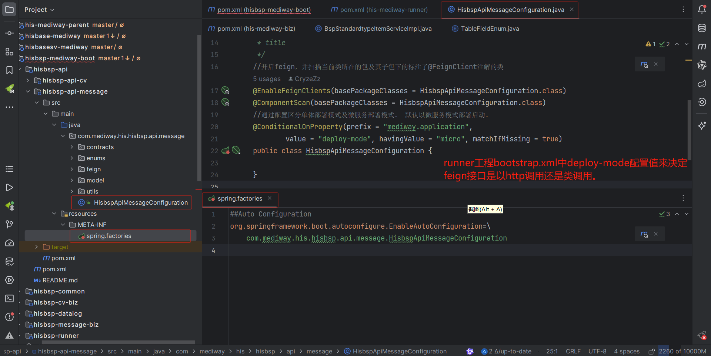

## 信创版-开发备忘录

#### 2025-04-01

- 使用menuForm.EpisodeID.value属性赋值时，会提示错误，浏览器`控制台`也会抛出异常，通过`控制台`的堆栈信息，可以定义到自己的代码。修改成`websys_setMenuForm({EpisodeID:2,PatientID:1,admType:'I',PPRowId:1}); ` 这种格式即可。 `读取值功能`不受影响。

#### 2025-03-29

- 切换数据库大小写敏感方式，修改like功能

  如果别名中有大小写字符时，使用双引号包裹处，以防数据库把列名转成全小写

  ```sql
  select locId as "ctLocId" from ct_org_location
  ```

  如果使用模糊查询功能可以使用`ilike`功能，来忽略大小查询

  ```sql
  (code ilike concat('%', #{dto.code}, '%') or description ilike concat('%',#{dto.code},'%'))
  ```

#### 2025-03-25

- 登录界面路径修改成`/imedical/his`

- 前台代码中写死路径的地方要修改

- nginx中以前`/his`的代理修改为以下代理

  ```nginx
  location /imedical/his {
  	alias D:/his-mediway-front/hisfront/static;
  	if ($request_filename ~* ^.+\.(?:html|js|css|png|jpg|gif|woff)$){
  		break;
  	}
  	if ($request_filename ~* "(.*?)(undefined)$"){
  		return 200 '{"message":""}';
  	}
  	try_files $uri $uri/ /imedical/his/hos/index.html;
  	index  index.html index.htm;
  }
  ```

#### 2025-03-01

- 查询his内数据时，`mapper`文件中不写死数据库schema名称`ho_his`

- feign类与controller类的路径要一致

- ```java
  // Feign内path
  @FeignClient(value="${mediway.application.emnur}",path="${server.servlet.context-path}/comem/emer/nurorder")
  //  Controller
  @RequestMapping("/comem/emer/nurorder")
  ```

#### 2025-02-27

晚间19点会议

#### 1、pom.xml中引入依赖jar时，除特殊情况外，不使用~~`<optional>`~~与~~`<scope>`~~配置

```xml
  <dependency>
  	<groupId>com.mediway.his</groupId>
  	<artifactId>xx-xxx</artifactId>
  	<version>1.0-SNAPSHOT</version>
  	<!--<optional>true</optional> 不使用-->
  	<!--<scope>provided</scope> 不使用-->        <!--compile值可以-->
  </dependency>
```

#### 2、程序中不直接注入 hos 的 service,应调用api接口，来解藕对HOS的依赖

#### 3、微服务工程中的`api`模块应该包含`Configuration`类及`spring.factories`配置文件

- 

#### 2025-02-26

- 说明：为统一各种操作系统下插件与医为浏览器，决定windows下也使用新版本插件及医为浏览器(内核chrome108)
- - 1、进入【常德】或【87系统】登录界面时会提示安装插件，点击下载安装即可，安装完成（建议使用常德登录界面下载，大小77M）。
- - 2、刷新登录界面会自动生成医为浏览器快捷方式到桌面上（不同项目生成的医为浏览器首页不同，医为浏览器图标与iMedical图标一样）
- - 3、使用桌面快捷方式入口进入系统


### 2024-09-27

- `gitlab`删除`addins/plugin`目录的管理，移到84服务器`/home/his/base/addins/plugin`下
- `.gitignore`文件忽略plugin目录，防止有人提交插件大文件

### 2024-09-26

- `nacos`服务器地址不再使用188的了，统一改成了http://81.70.230.87:8848/nacos

### 2024-09-24

- 因为现在测试和开发并行，现在如果开发库84上还有表结构更改和配置的变动，需要向崔工报备，并在代码提交后同步更新到测试库87上，避免代码和数据库匹配不上导致测试报错

### 2024-09-09

- 基础数据平台表名修改了一下内容
  `ct_ar_item_addinfo` -> `ct_mat_item`
  以下表没有做维护，只是迁移his里之前有的但是业务含义不明确或者不确定是否在用的字段，请用到的同事联系我确认
  `ct_oe_itmmast_addinfo` -> `ct_oe_itmmast_ext`  
  `ct_org_location` -> `ct_org_location_ext`
  `ct_org_useraccount_addinfo` -> `ct_org_useraccount_ext`
  `ct_org_healthorg_addinfo` -> `ct_org_healthorg_ext`
  `ct_rb_careprov_addinfo` -> `ct_rb_careprov_ext`
  `ct_or_operation_addinfo` -> `ct_or_operation_ext`
  `ct_mr_icddx_addinfo` -> `ct_mr_icddx_ext`
  注意事项：
  (1)医护人员的手机号，请大家优先取`hos_org_person`人员表里的mobile
  (2)是否麻醉师  请取医护人员表`ct_rb_careprov` 的 `anaesthetist_flag`
  (3)医嘱项的通用名方式获取方式联系药房药库，不要取自`ct_oe_itmmast_ext`表

### 2024-09-03

- 搭建`错误日志平台`，查看[详细说明](https://106.63.4.7:8000/his-mediway-java/his-document/-/blob/master/%E6%97%A5%E5%BF%97%E5%B9%B3%E5%8F%B0/readme.md)

### 2024-08-27

- 在`高斯`数据库中关于 `field=''`问题

- 如果表字段非varchar类型，高斯不允许使用`field=''`, 应该使用`field is null`

  ```sql
  select field1 from t_test where field_varchar=''   -- 可以运行
  ```

  ```sql
  select field1 from t_test where field_amount='' -- 人大金仓可以，高斯报错 field_amount为int类型
  select field1 from t_test where start_date=''   -- 人大金仓可以，高斯报错 start_date为date类型
  ```
  应使用以下方式
  ```sql
  select field1 from t_test where field_varchar is null or field_varchar=''
  select field1 from t_test where field_amount is null
  select field1 from t_test where start_date is null
  ```
  
  

### 2024-08-26

- 关于`count(*)`与`order by` 使用

  ```sql
  select count(*) as total from oe_ord_exec order by ex_stdatetime desc  -- 兼容性差
  ```

  以上代码可以在`人大金仓`上运行，在`高斯`数据库下报错，**正确**的写法应该如下：

  ```sql
  select count(*) as total from oe_ord_exec
  ```
  存在`group by`时，`count`与`order by`可以同时存在

  ```sql
  select count(*) as total, rule_alias from bsp_cache_tables where 1=1
  group by rule_alias order by rule_alias;
  ```
  


###　2024-08-24

- 润乾服务器地址由之前的： `111.205.6.225` 修改为`111.205.100.74` , 只修改ip地址即可，其他不变


### 2024-08-18

- 关于`LISTAGG`方法兼容性问题

  ```sql
  SELECT LISTAGG(doc.id,",") FROM mr_emrdb0_docdata doc     -- 兼容性差
  ```
  
  以上SQL在KingBase下可以执行，但在GaussDB下会报`missing WITHIN keyword`，应该使用以下兼容写法
  
  ```sql
  SELECT LISTAGG(doc.id,",") WITHIN GROUP (ORDER BY doc.id ASC)
  FROM mr_emrdb0_docdata doc
  ```

### 2024-08-17

- 升级HOS-2.5.4版本前端
- 修改表中字段名称
- - 表名全小写，单词间用下划线连接
  - 列名全小写，单词间用下划线连接

### 2024-08-16

- 大家删一下本地maven仓库中的hos-app-config的包，昨天hos修改了bug

- 因为`高斯`数据库不支持~~datetime~~数据类型，所以在导入时崔工统一修改成了date，但是测试发现date转LocalDatetime会报这个错，提个脚本将数据类型转成timestamp就可以解决这个问题

  ```cmd
  cannot convert the column of type DATE to requested type java.time.LocalDateTime
  ```

### 2024-08-14

- 因为`高斯`数据库中没有current_date()函数，所以要检查sql语句中是否使用了~~current_date()~~函数，如果有都修改成current_date

  ```sql
  where end_date>=current_date or end_date is null
  ```

  

- current_date变量取得`当天日期`，`时分秒`都为0，now()是取的当前的时间，精确到毫秒，按实际场景选择使用

### 2024-08-13

- 因为`高斯`数据库中~~日期字段名=''~~写法不被允许，需要删除相关代码

  ```sql
  start_date is null or start_date='' or start_date>=current_date    -- start_date=''兼容性差
  ```

  删除~~start_date=''~~，修改成

  ```sql
  start_date is null or start_date>=current_date
  ```

### 2024-07-08

- 引入hisui方式支持

  ```html
  <script type="text/javascript" src="../../../base/scripts/hisui.js"></script>
  ```

  实际引入了所有hisui相关js及css，也引入了websys.jquery.bsp.js

### 2024-06-29

- 润乾打印支持api打印功能可进入`http://106.63.4.7:8000/his-mediway-java/his-document/-/tree/master/润乾打印`界面查看说明