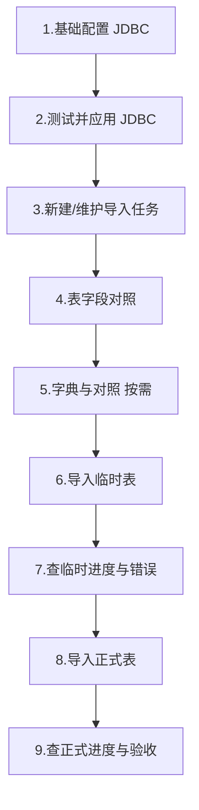

# HOS 数据迁移平台 — 实施操作手册

| 项目 | 说明 |
|------|------|
| 适用对象 | 实施、运维、数据迁移现场人员 |
| 适用系统 | HIS IHD 数据迁移模块（`hisihd-mediway-boot` + 前端 `bsp/ihd`） |
| 文档目的 | 按步骤完成「源库 → 临时表 → 正式业务表」迁移 |
| 版本说明 | 1.0 |

---

## 1. 业务概览

### 1.1 迁移两段式

```
源系统库（Cache/ IRIS / Oracle / 人大金仓等）
        │  JDBC 查询（或 Excel 文件）
        ▼
   HIS 临时/中间表（class_name 对应表，如 bsp_ihd_pa_pat）
        │  正式导入（按 ID 范围 / 字段分组等）
        ▼
   HIS 正式业务表
```

| 阶段 | 做什么 | 主要入口 |
|------|--------|----------|
| 准备 | 配 JDBC、建任务、字段对照、字典对照 | 基础配置 / 导入任务配置 / 通用字典 / 字典对照 |
| 临时导入 | 从源库或 Excel 写入中间表 | 数据迁移平台 → **导入临时表** |
| 正式导入 | 从中间表写入正式业务 | 数据迁移平台 → **导入正式表** |
| 核查 | 看进度与错误明细 | **临时表进度** / **正式表进度** |

### 1.2 界面 Tab 一览

进入 **数据迁移** 菜单后，顶部 Tab：


| Tab | 页面 | 作用 |
|-----|------|------|
| 数据迁移平台 | `import-data.html` | 选任务、写 SQL/选文件、导入临时/正式、看进度 |
| 基础配置 | `config.html` | JDBC 等键值配置（驱动、URL、用户、密码） |
| 导入任务配置 | `biz-config.html` | 业务任务（`cf_bsp_ihd_biz_config`）、参数、字段对照入口 |
| 通用字典 | `dictionary.html` | IHD 通用字典树 |
| 字典对照 | `map.html` | 内外码对照（旧码 → 新码） |

---

## 2. 前置条件（开干前确认）

1. **服务已启动**：IHD 后端（如 `hisihd-mediway-server`）可访问；前端已登录 HIS。
2. **源库信息**：IP/端口、库名（或命名空间）、账号密码、驱动类型已从现场获取。
3. **中间表已存在**：对应任务的 `class_name` 表已在目标 HIS 库建好。
5. **网络**：应用服务器能访问源库端口（防火墙放行）。

---

## 3. 标准操作流程（推荐顺序）




---

## 4. 步骤一：基础配置（JDBC）

**入口**：数据迁移 → **基础配置**


### 4.1 维护四条 JDBC 配置（均需「有效」）

| 配置代码 | 配置名称示例 | 配置值说明 |
|----------|--------------|------------|
| `jdbc.driverClassName` | JDBC驱动类 | 如 Cache：`com.intersys.jdbc.CacheDriver`；人大金仓：`com.kingbase8.Driver`；Oracle：`oracle.jdbc.OracleDriver` |
| `jdbc.url` | JDBC连接串 | 必须与驱动匹配（见下表） |
| `jdbc.username` | JDBC用户名 | 源库账号 |
| `jdbc.password` | JDBC密码 | 源库密码（列表显示为 `********`） |

**常见 URL 写法：**

| 源库 | 驱动类 | URL 示例 |
|------|--------|----------|
| 老 Cache | `com.intersys.jdbc.CacheDriver` | `jdbc:Cache://主机:1972/命名空间` |
| 人大金仓 | `com.kingbase8.Driver` | `jdbc:kingbase8://主机:5432/库名` |
| Oracle | `oracle.jdbc.OracleDriver` | `jdbc:oracle:thin:@//主机:端口/服务名` |

> **注意**：驱动与 URL 必须成对匹配。例如金仓驱动不要配 `jdbc:Cache://`，Oracle 不要用 `jdbc:orcl://` 非标准协议。

### 4.2 测试并应用

1. 保存四条配置且均为 **有效**。
2. 点击工具栏 **测试JDBC连接** → 提示连接成功即可。
3. 点击 **应用JDBC配置** → 确认后生效（进程内切换目标库连接）。
4. 服务重启后，一般会尝试从配置表自动加载 JDBC；若未就绪，需再次「测试 + 应用」。

### 4.3 密码说明

- 列表中密码显示 `********`，接口也会脱敏。
- **修改密码**：打开编辑，输入**新密码**后保存；若仍保存 `********`，系统视为未改，保留原密码。

---

## 5. 步骤二：导入任务配置

**入口**：数据迁移 → **导入任务配置**


### 5.1 新建 / 修改任务

1. 选择 **院区**、**产品组**（如有）。
2. **新增** 一条业务任务，重点字段：


| 字段 | 说明 | 示例 |
|------|------|------|
| 任务代码 `code` | 唯一业务编码 | `paPat` |
| 任务名称 `name` | 界面显示名 | 患者主索引 |
| 配置数值 `value` | 常用作默认 SQL / 说明用途 | 视项目约定（第三方示例） |
| 临时表实体类 `class_name` | **中间表表名**（枢纽） | `bsp_ihd_pa_pat` |
| 导入接口 | 正式导入时调用产品组的接口 | 按产品约定 |
| 默认条数 `default_count` | 正式导入按 ID 切分时每个线程条数 | 如 `50000` |
| 打包数量 `pack_number` | 正式导入时多少条中间表数据调用一次产品组接 | 如 `200` |
| 是否启用 | 必须启用后才能在迁移页选到 | 启用 |
| 覆盖导入 | 是否覆盖已有数据 | 按业务定 |

3. 保存后，列表中可通过链接进入：
   - **参数**：业务参数配置
   - 
   - **字段对照**：临时表字段对照（`table-map.html`）

---

## 6. 步骤三：表字段对照（必做）

**入口**：导入任务配置 → 任务行上的 **字段对照**（或打开 `table-map.html`）


临时导入时：源 SQL 结果列名（`map_field`）必须能对照到中间表字段（`source_field`）。缺对照会直接失败。

### 6.1 推荐操作

1. 填写 / 确认 **临时表实体类**（中间表名）。
2. 点击 **生成字段**（或按 SQL / Excel 获取字段）：
   - JDBC：用可代表结果集结构的 SQL 取列名；
   - Excel：上传模板表头生成列。
3. 逐行维护：
   - **源侧列名**（SQL 别名 / Excel 列名）→ **中间表字段名**
   - 需要字典转换的列，关联 **对照字典**
4. 点击 **保存**（或批量保存）。

### 6.2 校验

导入前可在迁移页确保 SQL 列都能对照；若提示「该字段 xxx 没有对照」，回到本页补全后再导。

### 6.3 列说明

- **是否必填**：要求该字段不能为空。
- **关联字典**：关联字段的对照字典，可以实现自动对照。
- **是否允许老系统字典对照为空**：如字面含义
- **是否允许字典对照失败为空**：如字面含义

### 6.4 校验

如果遇到界面点击无效，界面关闭再打开即可。

---

## 7. 步骤四：通用字典

- **通用字典**：维护新系统侧字典树。


在维护老系统字典时，维护上老系统的获取字典视图，然后点击**同步数据**即可将老系统字典同步过来。（前提：JDBC链接测试通过）


## 8. 步骤五：字典对照

- **字典对照**：维护「旧系统码值 → 新系统码值」。
- 

**原则**：先有字典与对照，再大批量正式导入，减少失败与脏数据。


---

## 9. 步骤六：导入临时表

**入口**：数据迁移 → **数据迁移平台**

### 9.1 选择条件

1. 选择 **院区**。
2. 选择 **导入任务**（lookup）。
3. 选择 **导入方式**：
   - **View（ODBC/JDBC 视图）**：在下方大文本框写 SQL；
   - **File（本地文件）**：选择 Excel（xls/xlsx）。


### 9.2 JDBC 方式（常用）

1. 在 SQL 框输入查询语句（建议带明确列别名，与字段对照一致）。
2. 点击 **导入临时表**。
3. 成功提示类似：「程序已经后台执行，进程号：xxx」。
4. 点击 **临时表进度** 查看批次状态（Start / End、成功数、失败数、耗时等）。

#### 多线程拆分（重要）

- 多条 SQL 用 **英文分号 `;`** 分隔，后端会拆成多任务并行执行。
- 每条 SQL 使用**独立 JDBC 连接**，互不占用同一条连接。
- SQL 文本内部尽量不要出现业务无关的 `;`，以免被误拆。
- 并发不宜盲目过大（如 15 路以上写同一张中间表）；可先 4～8 路观察库压力。

示例：

```sql
SELECT ... FROM old_pat WHERE id BETWEEN 1 AND 100000;
SELECT ... FROM old_pat WHERE id BETWEEN 100001 AND 200000;
SELECT ... FROM old_pat WHERE id BETWEEN 200001 AND 300000
```

### 9.3 Excel 方式

1. 导入方式选 **File**，选择文件类型与文件。
2. 可先用 **下载模板** 对齐表头。
3. 点击 **导入临时表**，按提示等待完成。
4. 用 **临时表进度** / 明细错误日志排查。

### 9.4 生成中间表（可选）

- 填写 **表名**，JDBC 方式填好 SQL 后点 **生成表**；或 Excel 方式用文件表头生成。
- 仅创建表结构，不代替字段对照与数据导入。

### 9.5 清临时表 / 清日志

| 按钮 | 作用 | 风险 |
|------|------|------|
| 清临时表 | 清空当前任务对应中间表数据 | 不可恢复，确认后再点 |
| 清除日志 | 清空导入相关日志表 | 排查记录会丢失 |

---

## 10. 步骤七：查看临时导入结果

**入口**：**临时表进度**（及临时明细错误日志页面）

关注：

| 项 | 说明 |
|----|------|
| 状态 | Start → End；异常是否有 error 信息 |
| 成功数 / 失败数 / 总数 | 是否与预期行数接近 |
| 明细错误 | `bs_bsp_ihd_temp_itm_log`：单行失败原因与参数，用于排查 |

**常见失败：**

- 字段未对照  
- JDBC 未应用 / 驱动 URL 不匹配  
- 源 SQL 语法错误 / 权限不足  
- 中间表非空约束、类型不匹配  

当前实现支持 **批量插入**；若整批失败会回退逐行并记录每条错误，便于排查。


---

## 11. 步骤八：导入正式表

**前提**：临时表数据已就绪，且失败率可接受。

1. 在数据迁移平台选好同一 **院区 + 导入任务**。
2. 点击 **导入正式表**。
3. 按弹窗设置：
   - **开始 ID / 结束 ID**（按中间表主键范围）  
   - 或按字段值 / 字段分组等方式（以界面选项为准）  
4. 系统可能按任务的 **默认条数** 自动切段多线程执行。
5. 点击 **正式表进度** 查看批次结果；失败看正式明细错误日志。

> 正式导入依赖任务上配置的 **导入类、导入方法**；未配置或类不存在会失败。


---

## 12. 步骤九：验收建议

1. 临时表抽样：`SELECT COUNT(*)`、关键业务键抽查。  
2. 正式表抽样：与源系统、临时表笔数对比。  
3. 字典类字段：抽查对照是否正确。  
4. 保留一批临时/正式日志备查（勿轻易「清除日志」）。  
5. 大表任务建议分批（按 ID 段 SQL），先小批量试跑再全量。

---

## 13. 日常运维与注意点

| 主题 | 建议 |
|------|------|
| JDBC 变更 | 改配置后必须重新 **测试 + 应用** |
| 长任务 | 勿重复狂点「导入」；用进度页观察；必要时用终止接口（若有授权） |
| 性能 | 临时导入已批量写中间表；源 SQL 尽量只查需要列；中间表索引过多会拖慢插入 |
| 密码安全 | 勿截图泄露明文密码；列表已掩码 |

---

## 14. 故障排查速查

| 现象 | 可能原因 | 处理 |
|------|----------|------|
| 测试 JDBC 失败 | 驱动/URL/账号/网络 | 核对四元组；查防火墙；确认 jar 已部署（Cache 需 CacheDB.jar） |
| 提示目标库 JDBC 尚未配置 | 未点「应用」或启动未加载成功 | 再点「应用JDBC配置」 |
| 字段 xxx 没有对照 | 字段映射缺失 | 补全表字段对照 |
| 临时导入很慢后期更慢 | 大表索引、并发过高、磁盘 | 降并发、减索引、分段 SQL |
| 部分线程结束/终止 | 人为取消、中断、异常 | 看临时日志 error；勿误点终止 |
| 正式导入无反应 | 导入类方法未配 / ID 范围空 | 检查任务配置与临时表是否有数据 |
| 密码保存后连不上 | 误把掩码当新密码保存 | 重新编辑输入真实新密码 |

---

## 15. 附录

### 15.1 关键配置表

| 表名 | 用途 |
|------|------|
| `cf_bsp_ihd_config` | 基础配置（含 JDBC） |
| `cf_bsp_ihd_biz_config` | 导入任务 |
| `cf_bsp_ihd_table_field_map` | 字段对照 |
| `ct_bsp_ihd_map` / `ct_bsp_ihd_map_itm` | 字典对照 |
| `bs_bsp_ihd_temp_log` / `bs_bsp_ihd_temp_itm_log` | 临时导入日志 |
| `bs_bsp_ihd_formal_log` / `bs_bsp_ihd_formal_itm_log` | 正式导入日志 |

### 15.2 相关后端路径（供联调）

| 功能 | 路径 |
|------|------|
| JDBC 列表/保存/测试/应用 | `/ihd/config/*` |
| 导入临时表 | `/ihd/import/temp` |
| 导入正式表 | `/ihd/import/formal` |
| 任务配置 | `/ihd/bizConfig/*` |
| 字段对照 | `/ihd/tableMap/*` |

### 15.3 操作检查清单（可复印）

- [ ] JDBC 四条已配且测试通过并已应用  
- [ ] 导入任务已启用，`接口` 正确  
- [ ] 字段对照完整  
- [ ] 需要的字典对照已维护  
- [ ] 小流量试导入临时表成功  
- [ ] 临时进度成功数符合预期，错误可接受  
- [ ] 正式导入试跑成功  
- [ ] 业务方抽样验收通过  
- [ ] 全量导入与终验完成  

---

若现场菜单名、按钮文案与本文略有差异，以实际环境界面为准；流程顺序建议仍按本文执行。

# 附：HOS数据迁移 - 实施操作手册

| 项目     | 说明                                                         |
| -------- | ------------------------------------------------------------ |
| 适用医院 | XX保健院,XX医院                                              |
| 适用对象 | 实施、运维、现场数据迁移人员                                 |
| 关联文档 | 《IHD数据迁移-实施操作手册》（平台通用操作见该文档）         |
| 文档目的 | 按现场实测节奏，完成本院患者档案、病案号、门诊预约三类业务迁移 |

> **说明**：本文聚焦「现场执行顺序与 SQL 分片」。JDBC 配置、任务配置、字段/字典对照、界面按钮等通用操作，请先按《IHD数据迁移-实施操作手册》完成。

---

## 1. 迁移范围与预计耗时

| 序号 | 业务       | 临时表（中间表）               | 临时表量级 / 并发   | 临时表预计  | 正式表策略                 | 正式表预计        |
| ---- | ---------- | ------------------------------ | ------------------- | ----------- | -------------------------- | ----------------- |
| 1    | 患者档案   | `bsp_ihd_pa_pat`               | 约 150 万 / 15 进程 | 约 1.5 小时 | 每进程 10 万条，约 16 进程 | 约 8 小时         |
| 2    | 患者病案号 | `bsp_ihd_ma_mr_medicareno`     | 约 44 万 / 15 进程  | 约 2 分钟   | 每进程 5 万条，约 8 进程   | 约 0.5 小时       |
| 3    | 门诊预约   | `bsp_ihd_paadm_op_appointment` | 约 8000 条          | 可忽略      | 按实际量导入即可           | 可忽略            |
| —    | **合计**   | —                              | —                   | —           | —                          | **约 9～10 小时** |

**建议导入顺序**（有依赖时勿颠倒）：

1. 患者档案  
2. 患者病案号  
3. 门诊预约  

---

## 2. 导入前检查清单

开始前请逐项确认：

- [ ] K8s 中 **ihd 服务**：建议 **8 核（约 16 线程）+ 8G 内存**（与现场实测一致）  
- [ ] 关闭日志，进一步提升效率
- [ ] 调用患者档案接口应付负债均衡接口，医生站服务实例根据需要多几起个（该项目8个实例）

---

## 3. 清库与清中间表

### 3.1 清除 HIS 业务数据

按院方/项目组既定方案，清除目标 HIS 库中相关**业务正式数据**。

### 3.2 检查并清空中间表

清业务数据后，检查下列中间表是否已空；**若不为空**，执行 truncate：

```sql
TRUNCATE TABLE bsp_ihd_pa_pat;
TRUNCATE TABLE bsp_ihd_ma_mr_medicareno;
TRUNCATE TABLE bsp_ihd_paadm_op_appointment;
```

可用快速核对：

```sql
SELECT 'bsp_ihd_pa_pat' AS tbl, COUNT(*) AS cnt FROM bsp_ihd_pa_pat
UNION ALL
SELECT 'bsp_ihd_ma_mr_medicareno', COUNT(*) FROM bsp_ihd_ma_mr_medicareno
UNION ALL
SELECT 'bsp_ihd_paadm_op_appointment', COUNT(*) FROM bsp_ihd_paadm_op_appointment;
```

期望结果：`cnt` 均为 `0`。

### 3.3 清除导入日志表

导入前清空进度/明细日志，避免与历史批次混淆（在 HIS 库执行）：

```sql
TRUNCATE TABLE bs_bsp_ihd_temp_log;
TRUNCATE TABLE bs_bsp_ihd_temp_itm_log;
TRUNCATE TABLE bs_bsp_ihd_formal_log;
TRUNCATE TABLE bs_bsp_ihd_formal_itm_log;
```

也可在数据迁移平台使用「清除日志」类功能（以界面实际按钮为准）。

---

## 4. 导入患者档案

### 4.1 导入临时表

| 项       | 值                                          |
| -------- | ------------------------------------------- |
| 任务     | 患者档案（中间表 `bsp_ihd_pa_pat`）         |
| 数据量   | 约 150 万                                   |
| 并发     | 15 个进程（界面将多段 SQL 用 `;` 分隔提交） |
| 预计耗时 | 约 1.5 小时                                 |

在「数据迁移平台」选择对应任务 → **导入临时表**，SQL 使用下方 **15 段**（按出生日期分片，以 `;` 分隔一次提交）：

```sql
SELECT * FROM pa_pat_mast_transfer WHERE EXP_STR='Y' AND BIRTH_DATETIME >= TO_DATE('0648-01-01 00:00:00','yyyy-mm-dd hh24:mi:ss') AND BIRTH_DATETIME <= TO_DATE('1969-12-31 00:00:00','yyyy-mm-dd hh24:mi:ss');
SELECT * FROM pa_pat_mast_transfer WHERE EXP_STR='Y' AND BIRTH_DATETIME >= TO_DATE('1970-01-01 00:00:00','yyyy-mm-dd hh24:mi:ss') AND BIRTH_DATETIME <= TO_DATE('1976-12-31 00:00:00','yyyy-mm-dd hh24:mi:ss');
SELECT * FROM pa_pat_mast_transfer WHERE EXP_STR='Y' AND BIRTH_DATETIME >= TO_DATE('1977-01-01 00:00:00','yyyy-mm-dd hh24:mi:ss') AND BIRTH_DATETIME <= TO_DATE('1980-12-31 00:00:00','yyyy-mm-dd hh24:mi:ss');
SELECT * FROM pa_pat_mast_transfer WHERE EXP_STR='Y' AND BIRTH_DATETIME >= TO_DATE('1981-01-01 00:00:00','yyyy-mm-dd hh24:mi:ss') AND BIRTH_DATETIME <= TO_DATE('1982-12-31 00:00:00','yyyy-mm-dd hh24:mi:ss');
SELECT * FROM pa_pat_mast_transfer WHERE EXP_STR='Y' AND BIRTH_DATETIME >= TO_DATE('1983-01-01 00:00:00','yyyy-mm-dd hh24:mi:ss') AND BIRTH_DATETIME <= TO_DATE('1986-12-31 00:00:00','yyyy-mm-dd hh24:mi:ss');
SELECT * FROM pa_pat_mast_transfer WHERE EXP_STR='Y' AND BIRTH_DATETIME >= TO_DATE('1987-01-01 00:00:00','yyyy-mm-dd hh24:mi:ss') AND BIRTH_DATETIME <= TO_DATE('1989-12-31 00:00:00','yyyy-mm-dd hh24:mi:ss');
SELECT * FROM pa_pat_mast_transfer WHERE EXP_STR='Y' AND BIRTH_DATETIME >= TO_DATE('1990-01-01 00:00:00','yyyy-mm-dd hh24:mi:ss') AND BIRTH_DATETIME <= TO_DATE('1992-12-31 00:00:00','yyyy-mm-dd hh24:mi:ss');
SELECT * FROM pa_pat_mast_transfer WHERE EXP_STR='Y' AND BIRTH_DATETIME >= TO_DATE('1993-01-01 00:00:00','yyyy-mm-dd hh24:mi:ss') AND BIRTH_DATETIME <= TO_DATE('1995-12-31 00:00:00','yyyy-mm-dd hh24:mi:ss');
SELECT * FROM pa_pat_mast_transfer WHERE EXP_STR='Y' AND BIRTH_DATETIME >= TO_DATE('1996-01-01 00:00:00','yyyy-mm-dd hh24:mi:ss') AND BIRTH_DATETIME <= TO_DATE('1998-12-31 00:00:00','yyyy-mm-dd hh24:mi:ss');
SELECT * FROM pa_pat_mast_transfer WHERE EXP_STR='Y' AND BIRTH_DATETIME >= TO_DATE('1999-01-01 00:00:00','yyyy-mm-dd hh24:mi:ss') AND BIRTH_DATETIME <= TO_DATE('2002-12-31 00:00:00','yyyy-mm-dd hh24:mi:ss');
SELECT * FROM pa_pat_mast_transfer WHERE EXP_STR='Y' AND BIRTH_DATETIME >= TO_DATE('2003-01-01 00:00:00','yyyy-mm-dd hh24:mi:ss') AND BIRTH_DATETIME <= TO_DATE('2013-12-31 00:00:00','yyyy-mm-dd hh24:mi:ss');
SELECT * FROM pa_pat_mast_transfer WHERE EXP_STR='Y' AND BIRTH_DATETIME >= TO_DATE('2014-01-01 00:00:00','yyyy-mm-dd hh24:mi:ss') AND BIRTH_DATETIME <= TO_DATE('2016-12-31 00:00:00','yyyy-mm-dd hh24:mi:ss');
SELECT * FROM pa_pat_mast_transfer WHERE EXP_STR='Y' AND BIRTH_DATETIME >= TO_DATE('2017-01-01 00:00:00','yyyy-mm-dd hh24:mi:ss') AND BIRTH_DATETIME <= TO_DATE('2019-12-31 00:00:00','yyyy-mm-dd hh24:mi:ss');
SELECT * FROM pa_pat_mast_transfer WHERE EXP_STR='Y' AND BIRTH_DATETIME >= TO_DATE('2020-01-01 00:00:00','yyyy-mm-dd hh24:mi:ss') AND BIRTH_DATETIME <= TO_DATE('2024-12-31 00:00:00','yyyy-mm-dd hh24:mi:ss');
SELECT * FROM pa_pat_mast_transfer WHERE EXP_STR='Y' AND BIRTH_DATETIME >= TO_DATE('2025-01-01 00:00:00','yyyy-mm-dd hh24:mi:ss') AND BIRTH_DATETIME <= TO_DATE('9992-12-31 00:00:00','yyyy-mm-dd hh24:mi:ss');
```

**临时表验收**：

- 「临时表进度」中本批次进程均已结束  
- 失败条数为 0，或已处理完错误明细  
- `SELECT COUNT(*) FROM bsp_ihd_pa_pat;` 与源库可导出行数基本一致（允许因过滤条件略有差异）

### 4.2 导入正式表

| 项       | 值                                   |
| -------- | ------------------------------------ |
| 分片策略 | 按临时表 ID，约 **100000** 条 / 进程 |
| 并发     | 约 **16** 个进程                     |
| 预计耗时 | 约 **8** 小时                        |

操作：数据迁移平台 → 选择患者档案任务 → **导入正式表**（按 ID 范围或界面默认分片）。

**正式表验收**：

- 「正式表进度」全部结束  
- 失败明细已导出并反馈产品组处理（若有）  
- 抽查患者档案在 HIS 业务界面可查询  

---

## 5. 导入患者病案号

> 建议在患者档案**正式导入完成并通过抽查**后再导入病案号。

### 5.1 导入临时表

| 项       | 值                         |
| -------- | -------------------------- |
| 中间表   | `bsp_ihd_ma_mr_medicareno` |
| 数据量   | 约 44 万                   |
| 并发     | 7个进程                    |
| 预计耗时 | 约 2 分钟                  |

```sql
SELECT * FROM bsp_ihd_ma_mr_medicareno WHERE LAST_ADM_DATE <= TO_DATE('2008-12-31 00:00:00','yyyy-mm-dd hh24:mi:ss');
SELECT * FROM bsp_ihd_ma_mr_medicareno WHERE LAST_ADM_DATE >= TO_DATE('2009-01-01 00:00:00','yyyy-mm-dd hh24:mi:ss') AND LAST_ADM_DATE <= TO_DATE('2011-12-31 00:00:00','yyyy-mm-dd hh24:mi:ss');
SELECT * FROM bsp_ihd_ma_mr_medicareno WHERE LAST_ADM_DATE >= TO_DATE('2012-01-01 00:00:00','yyyy-mm-dd hh24:mi:ss') AND LAST_ADM_DATE <= TO_DATE('2014-12-31 00:00:00','yyyy-mm-dd hh24:mi:ss');
SELECT * FROM bsp_ihd_ma_mr_medicareno WHERE LAST_ADM_DATE >= TO_DATE('2015-01-01 00:00:00','yyyy-mm-dd hh24:mi:ss') AND LAST_ADM_DATE <= TO_DATE('2017-12-31 00:00:00','yyyy-mm-dd hh24:mi:ss');
SELECT * FROM bsp_ihd_ma_mr_medicareno WHERE LAST_ADM_DATE >= TO_DATE('2018-01-01 00:00:00','yyyy-mm-dd hh24:mi:ss') AND LAST_ADM_DATE <= TO_DATE('2020-12-31 00:00:00','yyyy-mm-dd hh24:mi:ss');
SELECT * FROM bsp_ihd_ma_mr_medicareno WHERE LAST_ADM_DATE >= TO_DATE('2021-01-01 00:00:00','yyyy-mm-dd hh24:mi:ss') AND LAST_ADM_DATE <= TO_DATE('2023-12-31 00:00:00','yyyy-mm-dd hh24:mi:ss');
SELECT * FROM bsp_ihd_ma_mr_medicareno WHERE LAST_ADM_DATE >= TO_DATE('2024-01-01 00:00:00','yyyy-mm-dd hh24:mi:ss');
```

> **注意**：上述 SQL 在「导入临时表」时由 IHD 通过 JDBC 在**源库**执行。请确认源库中该表/视图名称与字段 `LAST_ADM_DATE` 实际存在；若源表名与 HIS 中间表同名，以现场源库对象为准。

### 5.2 导入正式表

| 项       | 值                     |
| -------- | ---------------------- |
| 分片策略 | 约 **50000** 条 / 进程 |
| 并发     | 约 **8** 个进程        |
| 预计耗时 | 约 **0.5** 小时        |

完成后在「正式表进度」确认全部结束，并抽查病案号业务数据。

---

## 6. 导入门诊预约记录

**注意：需要有门诊预约记录的患者档案视图，这样每次只增量导入少部分患者就行可以了，不用每次导入150W全量患者。**

| 项       | 值                             |
| -------- | ------------------------------ |
| 中间表   | `bsp_ihd_paadm_op_appointment` |
| 数据量   | 约 8000 条                     |
| 预计耗时 | 可忽略（数据量小）             |

操作要点：

1. 确认中间表已空（或仅本批次数据）  
2. 导入临时表（SQL 以现场任务配置/源表为准，数据量小可不强制分片）  
3. 导入正式表  
4. 抽查门诊预约记录  

---

## 7. 过程监控与异常处理

### 7.1 监控入口

| 场景                  | 入口                                     |
| --------------------- | ---------------------------------------- |
| 临时表进度 / 失败明细 | 临时表进度界面（可查看进程号、线程名称） |
| 正式表进度 / 失败明细 | 正式表进度界面                           |
| 导出错误              | 各进度页、明细页「导出」                 |

### 7.2 常见异常

| 现象                               | 建议处理                                                     |
| ---------------------------------- | ------------------------------------------------------------ |
| 长时间「进行中」且运行时间不再增加 | 看进程号对应线程；查应用日志是否停在「读源库」或「写临时表」；必要时「结束进程」后排查源库锁/目标库锁，再重导失败分片 |
| 字段对照错误                       | 到「字段映射」补全后，清空该业务中间表相关数据再重导         |
| 数据对照失败                       | 到「字典对照」补码后重导失败数据                             |
| 产品组接口报错（如院区 ID）        | 确认界面已选院区、导入接口地址正确；将【产品组】错误反馈对应产品组 |
| 多进程打满资源                     | 确认 K8s 为约 8 核 8G；可适当减少并发分片数                  |

### 7.3 重导原则

1. 先处理错误原因，再重导。  
2. 临时表重导前，确认是否需要 truncate 对应中间表，避免重复数据。  
3. 正式表重导前，与产品组确认是否允许重复写入或需先清业务数据。  

---

## 8. 总时间与排班建议

| 阶段                                | 预计                                    |
| ----------------------------------- | --------------------------------------- |
| 清库 + 清中间表 + 清日志 + 环境确认 | 视现场，建议预留 0.5～1 小时            |
| 患者档案（临时 + 正式）             | 约 1.5 + 8 ≈ **9.5 小时**（正式表为主） |
| 病案号（临时 + 正式）               | 约 2 分钟 + 0.5 小时                    |
| 门诊预约                            | 可忽略                                  |
| **现场连续作业**                    | **约 9～11 小时**（含准备与验收缓冲）   |

建议：患者档案正式导入安排在夜间或业务低峰；安排人员轮值查看「正式表进度」。

---

## 9. 完成后验收清单

- [ ] 三类中间表数据量与预期接近  
- [ ] 临时 / 正式进度无残留「进行中」进程  
- [ ] 关键错误明细已关闭或已登记跟踪  
- [ ] 患者档案、病案号、门诊预约在 HIS 业务侧抽查通过  
- [ ] 已通知业务方切换/验证，并保留本批次 `serialNo` / 日志备查  

---

## 附录：SQL 分片说明

- 界面导入临时表时，多段 SQL 用英文分号 `;` 分隔，后端会按段启动多个异步进程。  
- 分片条件（出生日期、末次入院日期等）用于控制单进程数据量，避免单线程过大或过不均。  
- 若某分片失败，可单独重跑该段 SQL，无需整批重来（注意中间表是否已有该段数据）。  