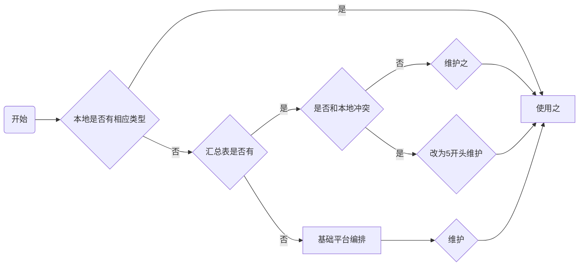

### 消息动作类型 ###

### 消息类型维护原则 ###

1. 项目本地已有相应消息类型则使用之
2. 项目本地没有，汇总单有，则在消息动作类型维护增加之
3. 项目本地没有，汇总单有，汇总单中代码和项目本地冲突，且在使用，则新增5开头的
4. 项目本地没有，汇总单也没有，告知基础平台，排一个消息代码并记录

### 消息动作汇总 ###

| 消息类型         | 代码 | 入参        | 接受对象           | 备注                                           |
| ---------------- | ---- | ----------- | ------------------ | ---------------------------------------------- |
| 通知 | 2000 | | | 发送通知用 |
| OA通知 | 2001 | | | OA通知，用户传代码，程序单独转成用户ID |
| 危急值 | 1000 | EpisodeID | 危急值平台配置 | 危急值平台通讯，响应对象的接口 `危急值平台` |
| 感染 | 1001 | EpisodeID | 主管医生 | `医政` |
| 处方点评(事后) | 1002 | EpisodeID | 主管医生 | `药房` |
| 处方审核(事前) | 1003 | OEOrdItemID | 主管医生 | `检验` |
| 检验报告取消审核 | 1004 | EpisodeID | 医疗单元、主管医生 | `检验` |
| 检查报告状态变化 | 1005 | EpisodeID |  医疗单元              | 再次审核 `pacs` |
| 标本拒收 | 1006  | OEOrdItemID | 病区护士（主管护士，护士长） | `检验` |
| 微生物中间报告 | 1007 | OEOrdItemID | 医疗单元 | `检验` or `病理`  |
| 病历质控 | 1008 | EpisodeId | 主管医生 | 时效性控制. `电子病历` |
| 终末质控  | 1009 | EpisodeId | 科室 | `电子病历` |
| 病人隔离 | 1010 | EpisodeId | 全病区护士与医生, 主管医生操作 | `医政` |
| 疑似 | 1011 | EpisodeId | 主管医生 | `医政` |
| 退回感染报告 | 1012 | EpisodeId | 写报告人（主动传入） | `医政` |
| 检验报告再次审核 | 1013 | OEOrdItemID | 医疗单元、主管医生 | `检验` |
| 会诊 | 1014 | OEOrdItemID | 单独指定 | `护士站` |
| 病案迟归 | 1015 | OEOrdItemID | 主管医生	 | 用来提醒医生病案没有上交给病案室的 `医政管理组` |
| 护士回退 | 1016 | OEOrdItemID | 下医嘱医生 | `护士站` |
| 病案回收失败 | 1017 | OEOrdItemID | 主管医生 | `医政管理组` |
| 传染病未报 | 1018 | OEOrdItemID | 主管医生 | `医政管理组` |
| 皮试结果 | 1019 | OEOrdItemID | 主管医生/就诊科室 | `护士站` |
| 维修提醒 | 1020 | 自传用户串 | 	 |  |
| 计量检测	 | 1021 |  | 自传用户串 |  | 
| 设备保修	 | 1022 |  | 自传用户串 |  | 
| 资质证书	 | 1023 |  | 自传用户串 |  | 
| 入库单待审核 | 1024	 |  | 自传用户串 | `药房`(2016-03-08新增) | 
| 出库单待审核 | 1025	 |  | 自传用户串 | `药房`(2016-03-08新增) | 
| 转移入库待接收 | 1026  | | 自传用户串 | `药房`(2016-03-08新增) | 
| 退货单待审核 | 1027  | | 自传用户串 | `药房`(2016-03-08新增) | 
| 调价单待审核 | 1028	 |  | 自传用户串 | `药房`(2016-03-08新增)(仅待审核,不判断生效与否) | 
| 药品信息待审核 | 1029 |  | 自传用户串 | `药房`(2016-03-08新增) | 
| 库存调整单待审核 | 1030 |  | 自传用户串 | `药房`(2016-03-08新增) | 
| 库存报损单待审核 | 1031 |  | 自传用户串 | `药房`(2016-03-08新增) | 
| 库存请求单出库 | 1032 |  | 自传用户串 | `药房`(2016-03-08新增) | 
| 采购计划待审核 | 1033 |  | 自传用户串 | `药房`(2016-03-08新增) | 
| 药物不良反应退回 | 1034 | EpisodeID | 填报医生 | `药房`(2016-03-16 新增) | 
| 紧急会诊 | 1035 | OEOrdItemID | 单独指定	 | `护士站`(2016-03-29 新增) | 
| 配血 | 1036 | OEOrdItemID | 主管医生 | 血库，`检验`(2016-05-10 新增) | 
| 发血 | 1037 | OEOrdItemID | 主管医生 | 血库，`检验`(2016-05-10 新增) | 
| 取血通知 | 1038 | OEOrdItemID | 主管医生 | 血库，`检验`(2016-05-10 新增) | 
| 手术通知 | 1039 | EpisodeID | 病区护士（主管护士，护士长） | `手麻组`(2016-05-24,新增） 增加一个呼叫准备功能，手术室选中患者，给主管护士发送消息，消息级别为紧急，信息内容为：请给某床+姓名+住院号+做术前准备 | 
| 检查取消接收 | 1040 | OEOrdItemID | 医疗单元或主管医生 | `检查组`(2016-05-24,新增) | 
| 有新医嘱	 | 1041 | EpisodeID | 病区护士 | `医生站` |
| 今日需续方 | 1042 | | 管床医生 | `医生站` |
| 病历授权申请 | 1043 | EpisodeID | 病案室所有人 | `电子病历`—医生申请 |
| 处方审核申诉 | 1044 | EpisodeID | 主管医生 | 药房 |
| 危急值重发 | 1045 | EpisodeID | 自拼userid | `基础平台`，如果15分钟内没有处理危急值，消息重发给医务科 |
| ~~抗菌药物审核~~   临床用药审核 | 1046 | EpisodeID | 自拼userid | `医生站`, 提醒医生，读过就可以。 |
| 停诊诊间通知 | 1047 | 自拼userid | `医生站`，如果医生停诊，门办则发消息给诊间护士，且护士读后给门办回执消息 |
| 拒绝发药申诉 | 1048 | EpisodeID | 自拼userid | 药房发现处方有问题，拒绝发药后，医生再申诉或确认时发消息给药房所有人 |
| 日报自动结账 | 1049 |  | 自拼userid | 收费员自动日结时，给组长发下消息 |
| 药房审核后医生停止 | 1050 | EpisodeID,OrdItemID |  | 药房审核医嘱之后医生又停医嘱的消息发送给药房 |
| 药房缺药 | 1051 | EpisodeID |  | 护士审核药品时，发现药品少了，发消息给科室医生. |
| 电子病历签名审核 | 1052 | EpisodeID | 主治医生 | 给上级医师发消息签名的动作 |
| 手术申请 | 1053 | EpisodeID，OrderItemID | 手术室（传用户） | `手麻组`(2016-12-14,新增) |
| 手术拒绝 | 1054 | EpisodeID | 申请人（用户） | `手麻组`(2016-12-14,新增) |
| 危急值 | 1055 | OrderItemID | 配置成空 | 住院---接收为三级医师---某项目特殊需求 |
| 处方点评申诉 | 1056 | OrderItemID |  | 医生进行处方点评申诉后，发消息给相关人(审核药师) |
| 费用核查 | 1057 |  | 1 | `计费` 晚上滚任务出，出问题会发一消息给demo，demo点处理进入处理界面 |
| 重点患者标记 | 1058 | EpisodeID | 主治医生 | 特殊患者标记、关闭 发消息提示主治医生 |
| 待审核医嘱 实习生医嘱 | 1059 |  | 业务串用户 | 待审核医嘱指实习医生开立的需要患者主管医生审核的医嘱。此处可以查看当前医生需要审核的医嘱信息。 |
| 护理提示 | 1060 | EpisodeID | 主治医生 | 护理提示指入院患者生活能力评分 <70的提示。此处可以查看当前医生主管患者的3天内的护理提示信息 |
| ~~抗菌药物审核结果~~   临床用药审核结果 | 1061 | EpisodeID | 自串UserId | 抗菌药物审核结果通知给申请人 `医生站` | 
| 会诊完成提示 | 1062 | EpisodeID | 自串UserId | 特殊需求，会诊完成提示 | 
| 抗菌药物会诊 | 1063 | EpisodeID | 自串UserId | 抗菌药物审核那边的一个配置，如果能走护理的会诊就走那个，不能的话走这个 | 
| 重点患者消息 | 1064 | EpisodeID | 主治医生 | 特殊患者消息指对特殊患者记录的处理而发送的消息 | 
| 电子病历签名 | 1065 | EpisodeID, | 自串UserId （主管医生，管床医生，及上级医生） | 二版电子病历使用的签名消息（1052） 须处理类消息 | 
| 首页质控提示 | 1066 | EpisodeID | 自串UserId（编目医生，建卡员， 财务，护士） | 首页质控系统使用的质控消息 | 
| 领药提醒 | 1067 | 无关 | 自串UserId（病区所有护士） | 中心药房与病区距离很远，中心药房配好药后，给病区护士发消息，让护士过来领药 | 
| 病历权限申请（同意） | 1068 | 无关 | 自串 | 读消息，一般， | 
| 病历权限申请（拒绝） | 1069 | 无关 | 自串 | 读消息，一般 | 
| 医保登记审核 | 1070 | EpisodeID | 固定科室（医保科） | 住院登记时，收费员将不能确定的病人信息推送给医保科所有用户，且等待医保登记审核 处理链接：websys.default.csp?WEBSYS.TCOMPONENT=INSUAudit | 
| 检验危急值 | 1071 | EpisodeID | 病区护士与科室医生 | 老的检验危急值是一个cs程序，维护工作量大，增加到消息平台中 | 
| 用药建议 | 1072 | OEOrdItem | 下医嘱医生 | 临床药学填写用药建议后 发送给医生、护士 | 
| 病人费用核查 | 1073 | EpisodeID | 护士 | 住院病人出院时，需要做财务审核，医嘱有问题 审核不通过就给病人一个标志 并通知护士站 | 
|  | 1074 |  |  | (苍州) | 
| 预防清洁手术 | 1075 | OEOrdItem | 下医嘱医生 | 预防清洁手术，抗生素发出下医嘱医生，医生处理，1续继使用，2停止医嘱重开 | 
| 慢性管控提醒 | 1076 |  |  |  | 
| 医保审核结果 | 1077 |  |  |  | 
| 待审核药品医嘱 | 1078 |  |  | 医生有开新药品医嘱下来，提醒药房 | 
| 多耐菌 | 1079 | EpisodeID | 主治医生 | 院感科发现多耐菌，向主治医生发送消息 | 
| 病历复核退回 | 1080 | EpisodeID |  | 病历归档复核时，电子病历病历退回时，可以发消息给提交电子病历的医生，并且有退回原因。 | 
| 物资材料审核 | 1081 |  |  | 新增的物资卫生材料，仓库会计新建字典后自动传送给物价员审核、调价（物价员电脑自动弹出提示框）  | 
| 新增收费项医保对照 | 1082 |  |  | 物价员审核调价后自动传送到医保办进行报销数据维护（医保办电脑自动弹出提示框）   | 
| 退费审核通过 | 1083 |  |  | 住院处和科室负责人增加会有退费审批操作，审批流程完全通过后，发送给退费申请人     | 
| 退费审核拒绝 | 1084 |  |  | 住院处和科室负责人增加会有退费审批操作，拒绝后发送给退费申请人  | 
| 停医嘱 | 1085 | OEOrdItemIds |  | 停医嘱时发送给住院护士 | 
| 撤销医嘱 | 1086 | OEOrdItemIds |  | 撤销医嘱也发送给病区护士 | 
| 传染病上报 | 1087 |  |  | 发送个公共卫生科   | 
| 中草药提醒 | 1088 |  |  | 开立的中草药，最后一天提醒医生，是否继续用药。  | 
| 项目到位资金 | 1089 |  | 自串用户Id（申请用户） | 科研处对用户提交的数据审核，审核过了之后自动通知该条数据对应的用户 | 
| 中检和验收 | 1090 | 无 | 自串用户Id（项目负责人） | 科教处提醒项目负责人这个项目应该中检或者验收（科研组） | 
| 未审核处方 | 1091 | EpisodeID | 医嘱的接收科室的所有医护人员 | 医生开了药品处方后，需要发消息给医嘱接收科室，提示药房审核 | 
| 住院审核 | 1092 | EpisodeID | 西院住院处 | 实现护士最终结算后，推送消息至住院处，告知住院处该患者可以进行住院审核 | 
| 收费项增加修改 | 1093 |  | 医保办人员 | 增加或修改收费项后，发消息给医保办人员，登陆医系统后有弹出消息提醒，点击【须处理】按钮后进入目录对照界面(定位到收费项目)  处理链接insutarcontrast.csp | 
| 费别修改 | 1094 |  | 主管医生 | 入院时没带医保卡，自费办入院，中途转成医保费别时，医保登记成功后发消息给主管医生，告知读消息 | 
| 处方拒绝 | 1095 | EpisodeID,OrdItem | 下医嘱医生 | 处方拒绝时发消息给医嘱的对应下医嘱医生(只读消息) | 
| 加急医嘱消息 | 1096 |  | 病区护士 | 加急医嘱的，通知护理  (1089) | 
| 不良事件上报 | 1097 |  |  | 不良事件上报发送给需要审核的人 | 
| 病理标本拒收 | 1098 | EpisodeID,OrdItem | 科室医生与病区护士 | 病理系统拒收标本后，拒绝信息发给给his的医生与护士 | 
| 追加术中抗生素 | 1099 | EpisodeID | 主管护士 | 增加一个呼叫术中追加抗生素的按钮功能，手术室选中患者，给主管护士发送信息，信息级别为紧急，信息内容为：请给某床+名字+住院号+追加术中抗生素 | 
| 输血申请单接收 | 1100 | EpisodeID | 主管医生 | 输血申请单接收后通知医生 | 
| 营养科关注的检验项目 | 1101 | EpisodeID | 营养科 | 检验结果中营养科关注的项目不正常时，发消息给营养科  | 
| 肿瘤慢病未报 | 1102 | EpisodeID | 主治医生 | 慢病病理检测出恶性肿瘤提醒 | 
| HIV阳性 | 1103 | EpisodeID,OrdItem | 下医嘱医生 | HIV阳性 | 
| 有新开医嘱 | 1104 | EpisodeID | 主治医生 | 住院医师签完病历之后，消息提醒治疗医师（医嘱的接收科室对应的所有医生） | 
| 梅毒阳性 | 1105 | EpisodeID,OrdItem | 下医嘱医生 | 梅毒阳性 | 
| 医技预约（护士） | 1106 | EpisodeID,OrdItem | 护士 | 护士看到消息后，给病人及时打印预约单    | 
| 医技预约(后勤) | 1107 | EpisodeID,OrdItem | 临床服务部 | 临床服务部看到后，打印派遣单，派遣医院后勤人员在预约时间接住院病人。 | 
| 床位预约 | 1108 |  | 病区护士 | 住院服务中心给病人预约床位后，在预约日期前一天给预约病区护士进行消息推送，病区护士将消息处理后回传给住院服务中心 | 
| 输血申请 | 1109 | EpisodeID,OrdItem | 业务传 | 输血临床审批流程发送给一个人审核  | 
| 多重耐药 | 1110 | EpisodeID,OrdItemId | 主治医生 | 检验医生发现多重耐药，发送信息给主治医生，主治医生收到信息，点击处理弹出医政的报卡界面(dhchai.ir.mrb.infmrbqry.csp)。 | 
| 护士领药审核   病区备药确认 | 1111 | EpisodeID | 业务传科室 | 护士领药审核后点击‘全区发送’/ ‘通知备药’后，给对应药房提示    | 
| 自费转医保审核 | 1112 | EpisodeID | 医保审核安全组工号 | 住院患者自费转医保需要经过医保办审批，住院医生发起申请，医保审核安全组的工号进行审批，消息发给医保审核安全组的工号，他们点处理时候最好是能直接弹出审批的菜单，进行审批。配置处理url。 | 
| 退药申请 | 1113 | EpisodeID,OrdItemId |  | 护士申请退药需要消息弹框提醒药房 | 
| 留观超期 | 1114 | EpisodeID | 主治医生 | 留观病人超72小时，提醒医生，并要求医生处理。   | 
| 过敏记录 | 1115 | EpisodeID | 病区护士 | 医生填写后，护士能自动收到，需要提示      | 
| 报告修改 | 1116 | EpisodeID,OrdItemId | 主治医生 | 检查科修改过报告后，把修改过的内容发给病人主治医生，主治医生看过后，消息就消失。 | 
| 停替诊 | 1117 |  | 自传 | 停替诊发消息通知挂号收费人员 | 
| 贵重药品 | 1118 | EpisodeID,OrdItemId | 自传 | 贵重药品，在护士做领药审核的时候对药房人员进行提示      | 
| 库存预警 | 1119 |  |  | 如果出现剩余库存超过药品维护库存下限了  则对药房药库相关人员进行消息提醒     | 
| 疑似病例 | 1120 | EpisodeID | 科室医生 | 医政监测疑似病例时发送消息给科室医生     | 
| 睡眠呼吸监测 | 1121 | EpisodeID,OrdItemId |  接收科室脑病科医生 | 医生开了医嘱：睡眠呼吸检测和睡眠呼吸监测过筛试验，需要自动发送消息到接受科室（脑病科）。接受科室看到消息，回信息给开单医生。开单医生再消息给接受科室     | 
| 住院医嘱点评 | 1122 | EpisodeID,OrdItemId |  下医嘱医生 | 住院医嘱点评 发给医生 | 
| 院感宣教 | 1123 |  | 自传 | 院感科针对性的对临床院感专员和医生进行知识宣教推送消息  `医务管理`  | 
| 检查报告取消审核 | 1124 | EpisodeID,OrdItemId | 主管医生  | 检查报告有误，取消审核发消息给主管医生     | 
| 住院草药退药 | 1125 | EpisodeID | 病区护士 | 住院草药不允许退药，除非草药房把处方置为可退，护士那边才能做退药申请 药房置为可退时，发消息通知病区护士 | 
| 降钙素原 | 1126 | EpisodeID | 自传 | 将首义院区内所有临床科室检验结果中的“降钙素原”项目数值大于“2”的消息弹窗发至重症医学科医生工作站 | 
| 入库进价变动 | 1127 |  | 自传 | 物资入库时，如果进价跟上次入库进价有变动，则进行消息提醒  | 
| 不入径审核通过 | 1128 | EpisodeID | 申请人（产品组自取） | 临床路径不入径申请，科主任审核通过，通知下申请人   | 
| 不入径审核拒绝 | 1129 | EpisodeID | 申请人（产品组自取） | 临床路径不入径申请，科主任审核拒绝，通知申请人，申请人要进行入径操作，将消息置为处理   | 
| 不良事件驳回 | 1130 | EpisodeID | 上报人（产品组自取） | 不良事件驳回，通知上报人    | 
| 护士拒绝医嘱 | 1131 | EpisodeID,OrdItemId | 下医嘱医生 | 护士处理医嘱，选择拒绝时，通知医生 | 
| 拒绝发药 | 1132 | EpisodeID,OrdItemId | 病区护士 | 护士领药审核，药房拒绝发药，消息提示病区护士  | 
| 分配处方 | 1133 | EpisodeID | 对应药师（产品组自取） | 处方点评中，处方分配给药师后，消息提醒药师   | 
| 病情证明书 | 1134 | EpisodeID | 分诊区护士 | 门诊医生在电子病历勾选门诊病情书后，保存病历后发消息通知分诊区护士    | 
| 拒绝退药 | 1135 | EpisodeID,OrdItemId | 病区护士 | 药房拒绝退药，发送消息通知病区护士 | 
| 拒绝发血 | 1136 | EpisodeID | 主治医生 | 拒绝发血后通知医生 | 
| 转科审核 | 1137 | EpisodeID | 产品组自取 | 转科需要审核，发给审核人 | 
| 迁档申请 | 1138 |  | 产品组自取 | 公共卫生系统中在A机构建立档案，B机构在建立这份档案的时候可以向A机构发送迁档申请 发送消息  | 
| 需停医嘱 | 1139 | EpisodeID， | 科室医生 | 滚医嘱时，如果国家集中采购的药品超过8万元时不生成执行记录，需要提醒医生去停医嘱    | 
| VTE评估 | 1140 | EpisodeID | 主管医生 | 评估某个病人得静默血栓，发出消息。分数大4分，可能是高危，提醒医生。评估为医政界面为：dhc.jsp | 
| 上级药师点评 | 1141 | EpisodeID | 产品组自己传 | 上级药师抽取已经被点评的处方，进行审核，查看一次点评药师点评的是否合理，不合理发给一次点评的药师 | 
| 住院超30天 | 1142 | EpisodeID | 科室医生与病区护士 | 病人住院30天，发送消息，提醒填写住院超过30天患者管理与评价表  | 
| 手术即将开始 | 1143 | EpisodeID | 主管医生病区护士 | 发送即将进行手术消息给病区护士和主管医生，护士进行准备工作   | 
| 手术即将结束 | 1144 | EpisodeID | 主管医生病区护士 | 发送即将结束手术消息给病区护士和主管医生，护士进行准备工作    | 
| 抗菌药物超36小时 | 1145 | EpisodeID,OrdItemId | 科室医生 | 使用目的为预防的抗菌药物长期医嘱，如果距离该医嘱开立时间超过36小时，则需要发消息给患者主管医生，提醒医生“预防应用抗菌药物超过36小时，请停用或改为治疗性应用” | 
| 体检报告质量上报 | 1146 | EpisodeID | 产品组自传 | 审核体检报告，对有问题的报告进行质量上报   | 
| 疑似传染病 | 1147 | EpisodeID | 主管医生 | 检验/放射结果中，符合意思传染病接口的，需要触发消息发送传染病疑似结果到医生  | 
| 出径审核拒绝 | 1148 | EpisodeID | 主管医生 | 临床路径出径申请，科主任审核拒绝，通知申请人   | 
| 出径审核通过 | 1149 | EpisodeID | 主管医生 | 主治医生、临床路径出径申请，科主任审核通过，通知申请人   | 
| 护理病历审批 | 1150 | EpisodeID | 上级护士 | 当护理病历修改时，需求要上级护士审批修改。 | 
| 精神病报卡状态异常 | 1151 | EpisodeID | 主治医生 | 严重精神疾病报卡状态异常 | 
| 院感预警 | 1152 | EpisodeID | 主治医生 | 杏林系统出现院感预警值时，发送消息给主治医生 | 
| VTE健康宣教 | 1153 | EpisodeID | 病区护士 | 医生vte评估，如果勾选了健康宣教，需要给护士发消息 | 
| 护理病历医生签名 | 1154 | EpisodeID | 科室医生 | 护士写完这个护理病历，保存后，医生站消息有提醒，之后医生在这个护理病历上签名  | 
| 会诊通知 | 1155 | EpisodeID | 产品组自定 | 会诊申请时，同时发消息给医务部，与医院质量办公室  消息与会诊状态独立，新建消息类型    | 
| 静配医嘱审查结果 | 1156 | EpisodeID，OrdItemId | 下医嘱医生 | 静配医嘱审查后，结果通知医生 | 
| 急诊病人签床通知 | 1157 | EpisodeID |  | 住院管理处给急诊的新入院病人签床之后，发消息给急诊的护士，给病人办理结账，让病人住院   | 
| 新开住院证患者 | 1158 | EpisodeID | 产品组传住院证要入科室\|ToDoctor | 当门急诊医生开完住院证后需给本科病区发送消息，提醒病区医生有新开住院证患者，请尽快给患者预约床位 | 
| 床位预约成功 | 1159 | EpisodeID | 就诊科室 | 急诊的留观和抢救区的患者预约床位成功后，给开住院证的整个急诊科室发消息，提醒“该患者床位预约成功” | 
| 体检高危 | 1160 | EpisodeID | 科室医生 | 现在主要是体检高危的消息，体检的过程会上报检查严重的阳性体征，发消息给科室医生 | 
| 申请恢复医嘱 | 1161 | EpisodeID，OrdItemId | 产品组自传护理部 | 护士撤销执行医嘱之后，申请恢复到撤销之前的已执行状态，发消息给护理部审核  | 
| 多科会诊审核 | 1162 | EpisodeID | 产品组自取 | 多科会诊需要科主任审核，发送消息提醒    | 
| 核酸检测结果 | 1163  | EpisodeID | 科室医生 | 增加【核酸检测】 | 
| 远程会诊 | 1164  | EpisodeID | 科室医生 | 需求发起远程会诊消息，点击处理时切换到对应会诊科室与安全组系统 | 
| 不良事件审核 | 1165 | EpisodeID | 产品组自取 | 不良事件审核   --标准版
| 检验标本接收 | 1166  | EpisodeID,OrdItemId | 主管医生 | 检验标本接收 | 
| 检验标本核收 | 1167 | EpisodeID,OrdItemId | 主管医生 | 检验标本核收 | 
| 检验报告审核 | 1168 | EpisodeID,OrdItemId | 主管医生 | 检验报告审核 | 
| 检验标本取消核收 | 1169 | EpisodeID,OrdItemId | 主管医生 | 检验标本取消核收 | 
| 血库拒收 | 1170 | EpisodeID,OrdItemId | 主管医生 | 血库拒收输血申请单 | 
| 新开会诊医嘱 | 1171 | EpisodeID,OrdItemId | 自传 LocId\|ToNurse | A科医生给其它科室会诊时，开医嘱时消息提醒A科对应病区护士处理医嘱     | 
| 手术申请审核 | 1172 | EpisodeID | 科主任 | 住院所有手术申请均需要科主任审核，所以需要将申请信息发送给科主任 | 
| 危急值转发 | 1173 | EpisodeID,OrdItemId | 产品组传 | 危急值转发给某医生  --危急值转发
| 病案编目 | 1174 | EpisodeID | 自传 | 病案编目时，有啥问题可以发消息通知主管医生    | 
| 双向转诊 | 1175 | EpisodeID | 自传 | 卫生院医生通过双向转诊界面预约了转诊， 病人去科技城医院取号成功后，接诊后，住院后 将病人的取号信息传给卫生院的医生 | 
| 检查结核审核 | 1176 | EpisodeID | 全体医护人员（医生与护士） | 病人在做检查时，如果检查出结核的病灶，审核报告的时候需要推送消息给临床医生和护士，以前是手工的业务，结核指针会以纸质的单据送到医生处，现在需要在系统推送消息，告知医生病人有结核。 | 
| MDT会诊 | 1177 | EpisodeID | 自传 | MDT会诊发送后给会诊医生发送的消息，会诊医生阅读消息后变已处理  | 
| 麻醉医生医嘱 | 1178 | EpisodeID,OrdItemId | 手术护士、麻醉护士安全组 | 麻醉科医生开医嘱，需要提醒麻醉护士和手术室护士    | 
| RIS危急值 | 1179 |  |  | 医技科室发现危急值时，手动发送消息给医生。某项目要将危急值按检验检查发送不同消息类型，此类型作为检查危急值 20200827
| 体温升高预警 | 1180 | EpisodeID | 公共卫生科 | 患者体温高于37.3°C时，提醒公共卫生科     | 
| 报卡退回 | 1181 | EpisodeID | 产品组自取上报人 | 院感办把报卡退回的时候通过消息平台提醒上报医生     | 
| 会诊超时 | 1182 | EpisodeID | 产品组自传 | 会诊接收后超过12小时未完成 发消息提醒接收人         | 
| 预防使用抗菌药物超三天 | 1183 | EpisodeID | 主管医生 | 院感发现预防使用抗菌药物超三天时消息提醒主管医生  | 
| 临床路径入径提醒 | 1184 | EpisodeID | 病区护士 | 患者入径后发消息提醒护士   | 
| 不良事件转抄 | 1185 | EpisodeID | 自传 | 不良事件的转抄业务  | 
| MDT会诊完成通知 | 1186 | EpisodeID | 自传 | MDT会诊完成后通知各会诊医生   | 
| 处方审核通过 | 1187 | EpisodeID,OrdItemId | 下医嘱医生 | 药房处方审核通过后，发消息提醒下医嘱医生，读即处理   | 
| 退费申请 | 1188 | EpisodeID | 自传 | 门诊医生进行退费申请时发消息通知收费处   | 
| 会诊审核 | 1189 | EpisodeID | 科主任 | 科主任待审核会诊消息，点开后，链接到会诊审核界面，会诊申请被审核后，该消息即消失  | 
| 营养科关注医嘱 | 1190 | EpisodeID,OrdItemId | 营养科 | 临床科室开固定的某些医嘱，审核后，会自动给营养科发送消息    | 
| 化疗方案 | 1191 | EpisodeID,OrdItemId | 发给上级医生 | 申请医生发化疗方案，给上级医生审核消息；绑定上级医生审核界面  | 
| 化疗方案审核 | 1192 | EpisodeID,OrdItemId | 发送给药房药师 | 上级医生审核完消息后再发药房药师消息。绑定药房药师处理界面 | 
| 化疗方案成功 | 1193 | EpisodeID,OrdItemId | 发送申请医生 | 药师审核完成后，发消息给申请医生 | 
| 医保患者出院 | 1194 | EpisodeID,OrdItemId | 发送给医保办 | 医生审核出院医嘱后，给医保办发送消息， 然后医保办去医保审核界面审核相应的患者，医保患者才能办理结算 | 
| 非计划再次手术 | 1195 | EpisodeID | 科室-医务科 | 非计划再次手术需要发送消息给医务科   | 
| 不良事件未转归 | 1196 | EpisodeID | 自传 | 不良事件（跌倒、护理意外、药物外渗、非预期压疮）超过一个月未填转归，消息提醒护士长   | 
| 外出检查未归 | 1197 | EpisodeID | 病区护士 | 如有已外出检查扫描，24小时内未返回的，消息提醒病区护士 | 
| 药学咨询 | 1198 |  | 自传 | 临床药学、药学咨询，医生咨询后，药师界面增加消息提醒   | 
| 死亡患者未报 | 1199 | EpisodeID | 主管医生 | 死亡患者填写了死亡医嘱后，未及时报卡发消息给主管医生，提醒及时报卡     | 
| 超量用血提醒 | 1200 | OrdItemID | 下医嘱医生 | 超量用血提醒申请医生，补提输血申请单   | 
| 医嘱审核 | 1201 | EpisodeID | 主治医生 | 实习医嘱审核 | 
| 输血审核 | 1202 | EpisodeID |  | 大量用血审批-科主任审核 | 
| 输血审核 | 1203  | EpisodeID |  | 大量用血审批-医务审核 | 
| 用药建议申诉 | 1204 | EpisodeID |  | 临床药学，医生对药师填写的用药建议提出申诉后，发送消息给药师  ---标准版 `药房药库` | 
| 慢病干预提醒 | 1205 | EpisodeID | 主管医生 | 慢病系统中对患者进行干预操作，将干预措施发消息提醒HIS主管医生    | 
| 调停诊申请 | 1206 |  |  | 医生调停诊发消息通知门诊办进行审核      | 
| 手术排班成功 | 1207 | EpisodeID |  | 手麻系统进行手术排班成功后，提醒手术医师     | 
| 特抗药会诊 | 1208 | EpisodeID |  | 特殊级抗菌药物会诊要和普通会诊区分开  | 
| 三病筛查提醒 | 1209 | EpisodeID | 主管医生 | B超宫内早孕、宫内单活胎或宫内双活胎、宫内晚孕；检验血(HCG> 5mIU/ml)或尿HCG(+) 发送消息提醒主管医生  联系患者到医院三病筛查    医生开三病筛查医嘱或某授权人选择终止 方将消息置为已处理 | 
| 日间手术通知 | 1210 | EpisodeID，OrdItemId |  | 日间手术流程--1.增加发送手术通知功能，发送的内容可以面向病人（上下午不同）、主刀、麻师，发送内容可以在基础平台中维护    | 
| 换床通知 | 1211  | EpisodeID |  |  | 
| 转科通知 | 1212 | EpisodeID |  |  | 
| 急诊手术申请 | 1213 | EpisodeID |  | 医生申请手术后，发消息给手术室护士，请求手术排班   | 
| 危急值特殊原因结束审核 | 1214 | EpisodeID |  | 危急值医生可以选则特殊原因将危急值置为结束，而不需要走正常的处理复查流程，需要提醒职能部门审核   | 
| 危急值特殊原因结束审核结果 | 1215 | EpisodeID |  | 危急值特殊原因结束职能部门审核结果通知给置标志人  | 
| 新的治疗申请 | 1216 | EpisodeID,OrdItemId | 医嘱接收科室技师 | 医生给患者开治疗申请后，消息提醒医嘱接收科室   | 
| 限制用药医嘱审核结果 | 1217 | EpisodeID,OrdItemId | 下医嘱医生 | 医保办与医务部对限制用药的医嘱审核结果，消息提醒开医嘱医生  | 
| 有新中草药处方 | 1218 | EpisodeID | 中药房 | 医生新开草药处方时，提醒中药房 | 
| 医技预约 | 1219 | EpisodeID,OrdItemId | 下医嘱医生 | 医技预约后发消息提醒医生 | 
| 会诊驳回 | 1220 | EpisodeID | 自传 | 会诊审核驳回后，增加消息推送功能，推送给申请医师，当前会诊已驳回并显示驳回原因--标准版 `新产品组` | 
| 会诊拒收 | 1221 | EpisodeID | 自传 | 会诊拒收，增加消息推送功能，推送给申请医师，会诊已拒收--标准版 `新产品组` | 
| 单病种上报提醒 | 1222 | EpisodeID | 主治医生 | 单病种系统筛选出符合单病种的患者，发消息提醒主管医生进行上报 | 
| 药品断货提醒 | 1223 | EpisodeID | 自传科室 | 药品断货标识发生变化时，发送消息提醒相应的药房科室     | 
| 药品直送提醒 | 1224 | EpisodeID | 自传科室 | 药品直送标识发生变化时，发送消息提醒相应的药房科室     | 
| 药品调价通知 | 1225 |  | 全体用户 | 药品调价后，给全体用户发送药品调价信息       | 
| 新开静配医嘱 | 1226 | EpisodeID,OrdItemId | 医嘱接收科室用户 | 有新开静配医嘱时，提醒静配中心 | 
| 血糖预警 | 1227 | EpisodeID | 主管医生 | 护士录入血糖时，当达到预警值，系统自动发消息提醒主管医生 | 
| 营养科会诊 | 1228 | EpisodeID | 主管医生 | 患者病历营养筛查表得分大于等于3分发消息给临床医生提醒临床医生需要营养科会诊    | 
| 营养科会诊 | 1229 | EpisodeID | 营养科 | 患者病历营养筛查表得分大于等于3分发消息给营养科医生提示该名患者得分大于等于3分需会诊     | 
| DRGS预警 | 1230 | EpisodeID | 主治医生医疗单元 | DRGS预警消息提醒主管医生医疗单元    | 
| 病案滞归 | 1231 | EpisodeID | 主治医生 | 存在滞归病历，病案室给主管医生发送消息进行提醒   --标准版 `病案管理组` | 
| VTE填报(护士) | 1232 | EpisodeID | 病区护士 | 病人入院后，如果年龄大于14岁，发消息提醒病区护士，填报后置为已处理    | 
| VTE填报(医生) | 1233 | EpisodeID | 主治医师医疗单元 | 护士填报完vte后，发消息提醒医生，填报后置为已处理   | 
| 危急值需复查 | 1234 | EpisodeID | 发送者 | 医生在处理危急值消息时，设置一复查时间，到时间时发消息提醒自己   | 
| 非计划入院 | 1235 | EpisodeID | 高级：医务科 | 院登记的时候如果是非计划入院的患者要给医务科发一条消息    | 
| 病案归档提醒 | 1236 | EpisodeID | 高级：病案室 | 当医生点击病案首页上的送病案室按钮后，向病案室发送消息，病案室点击此消息可以直接打开相应的病案首页 | 
| 材料请求单审核不通过 | 1237 |  | 自传 | 材料请单审核不通过时发消息通知      | 
| 固定资产出库 | 1238 |  | 自传 | 第三方固定资产出库信息要在消息里面有显示，包含出库人、出库资产名称、出库科室、出库日期   | 
| 物资出库 | 1239 |  | 自传 | 第三方物资出库信息要在消息里面有显示，包含出库人、出库资产名称、出库科室、出库日期     | 
| 投诉信息 | 1240 |  | 自传 | 第三方投诉管理系统投诉信息要在消息里面有显示，包含投诉人、投诉日期、投诉医生      | 
| 不良事件审核结果 | 1241 |  | 自传 | 第三方不良事件上报后，最后审核结果发消息提醒医生      | 
| 感染标志物阳性 | 1242 | EpisodeID | 科室医生与病区护士 | 一些感染标志物的检验结果为阳性时发送消息提醒临床      | 
| 停现场 | 1243 |  | 安全组门办 | 门诊医生停止新挂号      | 
| 护理级别变更 | 1244 | EpisodeID | 主管医生 | 护理级别变更发送消息给主管医生      | 
| 线上预约成功 | 1245 |   | 固定科室 | 线上预约成功后，需护士判断医生是否有空，否则取消患者的线上预约      | 
| 付费处方发药 | 1246 | EpisodeID | 高级：药房 | 处方结算成功后，发送消息给药房提示有可发药处方      | 
| 发药提醒 | 1247 | EpisodeID | 高级：住院西药房 | 智能药柜药品需要发药时，提醒药房去进行发药操作      | 
| 转诊申请 | 1248 | EpisodeID | 自传 | 转诊申请发送给相应审核人      | 
| 出院医保预审 | 1249 | EpisodeID | 科室-医保办 | 医生开出院医嘱，如果是医保患者，通知医保办预审核      | 
| 出院医保终审 | 1250 | EpisodeID | 科室-医保办 | 护士进行护理结算后，如果是医保患者，消息提醒医保办进行审核      | 
| 医保预审反馈 | 1251 | EpisodeID | 主治医生 |  医保预审结果反馈给主管医生      | 
| 医保终审反馈 | 1252 | EpisodeID | 主治医生+病区护士 | 医保终审结果反馈给医生和病区护士      | 
| 患者出院 | 1253 | EpisodeID | 科室-出入院处 | 自费患者护士结算后通知住院处；医保患者在医保办审核后通知住院处      | 
| 上报提示 | 1254 | EpisodeID | 医生 | 上报消息后，异步等待回传结果，回传结果放到消息中      | 
| 病历质控护士 | 1255 | EpisodeID | 病区护士 | 病历质控退回护士类型，发给患者所在病区所有护士，需要处理 `病历质控`     | 
| 不合理医嘱药师强制审核 | 1256 | EpisodeID | 药房 | 医生下医嘱进行医嘱审核时，调用新产品合理用药，需要强制审核时发消息给药房      | 
| 手术资质申请 | 1257 |  | 自传 | 手术资质申请发给审核人（一级审核）      | 
| 手术资质申请（医务部） | 1258 |  | 医务部 | 手术资质申请，审核人审核通过后发给医务部审核（二级审核）      | 
| 手术资质申请结果 | 1259 |  | 自传 | 手术资质申请，审核人拒绝后发送给申请人；医务部拒绝后给申请人和一级审核人      | 
| 门诊危急值 | 1260 |  | 自传 | 门诊危急值不需要弹出，和住院表现不一样，单独拿出来      | 
| 路径表单审核 | 1261 |  | 自传 | 新临床路径表单发布审核消息      | 
| 需核酸检测 | 1262 | EpisodeID | 主管医生 | 患者住院超过13天后，提醒医生患者需要核酸检测      | 
| 危急值病历提醒 | 1263 | EpisodeID | 自传 | 患者危急值处理一小时后还没有写病历，系统发消息提醒处理医生     | 
| VTE高危患者 | 1264 | EpisodeID | 主管医生 | VTE评估高危患者通知医生  护理记录单    | 
| TDM药师建议 | 1265 | EpisodeID | 自传 | TDM药师建议发给医生  第三方      | 
| 危急值已处理 | 1266 | EpisodeID,OrdItemID | 自传科室 | 医生处理危急值后消息通知医技科室(HIS内)      | 
| 病理延迟报告 | 1267 | EpisodeID,OrdItemID | 下医嘱医生 | 病理延迟报告      | 
| 病理拒收申请单 | 1268 | EpisodeID,OrdItemID | 科室医生与病区护士 | 病理拒收申请单      | 
| 病理发布冰冻报告 | 1269 | EpisodeID,OrdItemID | 科室医生与病区护士 | 病理发布冰冻报告      | 
| 病理标本不合格 | 1270 | EpisodeID,OrdItemID | 科室医生与病区护士 | 病理标本不合格      | 
| 预约床位被占用 | 1271 |  | 床管中心 | 当预约的床位，被其他特殊情况占用时，发消息提醒床管中心      | 
| 血糖预警 | 1272 | EpisodeID | 主治医生 | 护士录入血糖时，当达到预警值，系统自动发消息提醒主管医生      | 
| 核酸上报异常 | 1273 |  | 自传 | 核酸上报接口异常通知信息科      | 
| 配液申请 | 1274 | EpisodeID,OrdItemID | 医嘱接收科室用户 | 门诊护士配液申请后，提醒对应的配液中心      | 
| 护理病历修改申请 | 1275 | EpisodeID | 高级：科室-病案室 | 护理病历提交到病案室后，如果需要修改病历，发消息提醒病案室      | 
| 病历转移申请 | 1276 | EpisodeID | 主治医生 | 转科患者之前科室的医生需要修改病历内容需要向患者当前所在科室的主管医生申请病历转移，获取书写病历的权限      | 
| 新增医嘱项申请 | 1277 |  | 科室-信息科 | 财务科新增医嘱项需要信息科审核，发送消息给信息科      | 
| 医嘱项审核结果 | 1278 |  | 科室-财务科 | 信息科审核过后（实际是修改了截止日期或启用标志）发消息给财务科      | 
| VTE评估结果 | 1279 | EpisodeID | 病区护士 | 医生进行VTE评估（电子病历）后达到中高风险后调用，将消息推送到护士站的消息列表中进行提醒      | 
| 手术申请变更 | 1280 | EpisodeID | 自传 | 医生手术申请变更时，发送消息通知      | 
| 三级质控消息 | 1281 | EpisodeID | 自传 | 质控专家给患者病历的初级质控人员和院级质控人员发消息      | 
| 门诊病历质控 | 1282 | EpisodeID | 主管医生 | 门诊病历质控发消息给医生，和住院的区分开      | 
| 新增药品 | 1283 |  | 安全组-药学部 | 药品信息维护新增医嘱项时，发送消息给药学部      | 
| 药品库存项批文修改 | 1284 |  | 安全组-医保办 | 药品库存项批文修改后发消息给医保办      | 
| 患者挂号 | 1285 |  | 自传 | 患者挂号在特定情况(MDT会诊需要患者自己微信挂号)下发送消息给医生      | 
| 临床路径阶段提醒 | 1286 | EpisodeID | 病区护士 | 医生完成某个阶段的临床路径的时候发消息提醒病区护士      | 
| 护士已收取外伤资料 | 1287 | EpisodeID | 科室-医保办公室 | 护士收取外伤资料后发送消息提醒医保办       | 
| 编目提醒 | 1288 | EpisodeID | 科室-病案室 | 病案回收后给病案室发个消息提醒病案室老师进行病案编目      | 
| 报告解读通知 | 1289 | EpisodeID |  | 当患者的检验报告已出时，由门诊护士或报告室的护士发消息通知健管师、客户经理或主管医生解读报告      | 
| 护理质控问题 | 1290 |  | 自传用户 | 护理质量检查问题发消息提醒此病区护士长      | 
| 病理报告审核 | 1291 | EpisodeID | 主管医生 | 病理报告发布后，提醒科室医生      | 
| 病理报告取消审核 | 1292 | EpisodeID | 主管医生 | 病理报告取消审核后，提醒科室医生      | 
| 停营养科医嘱 | 1293 | EpisodeID | 自传科室ID | 临床科室医生停营养科医生开的长期医嘱时，消息提醒营养科医生。      | 
| 总检后重发报告 | 1294 |  | 自传用自传总检医生用户ID户 | 体检总检后，如果检查或者检验系统里面重新发了报告，想给总检大夫做个提醒   --标准版体检      | 
| 加号申请 | 1295 |  | 自传用户 | 线上加号申请后，发送消息通知相应号别的医生和分诊台，通过或拒绝后处理消息      | 
| 病案首页质控 | 1296 | EpisodeID | 主治医生 | 质控人员对患者的住院病案首页病历进行质控审核，发现病历中存在的问题，发送给相应主管医生，医生可以查看消息，进入问题病历，反馈整改情况给质控人员   --标准版 病历质控      | 
| 退药药品停用提醒 | 1297 |  | 安全组-药库管理员 | 退药的药品如果已经被停用发送消息提醒药库管理员1安全组     | 
| 药品效期提醒 | 1298 |  | 自传 | 药品效期在6个月内的，消息提醒对应药房      | 
| 出库拒绝接收 | 1299 |  | 自传 | 药房药库出库拒绝接收时发送消息给出库方科室      | 
| 抗菌药超7天 | 1300 | EpisodeID | 主治医生 | 患者抗菌药使用超过7天，发消息提醒主管医生“抗菌药物使用时间超7天，请相关科室或临床药师会诊方可使用“      | 
| 病区未提交排班 | 1301 |  | 自传 | 病区未提交排班时发消息提醒该病区护士长      | 
| 复查仍为危急值 | 1302 | EpisodeID | 医务科 | 危急值上报时判断，此医嘱为危急值复查医嘱出的危急值的复查医嘱（即危急值复处理一次之后，复查还是危急值，再处理再复查还是危急值） 消息提醒医务科      | 
| 药品停用提醒 | 1303 |  | 安全组-xx医师 | 药库将药品停用后，发消息提醒给医生      | 
| 检验预报告 | 1304 | EpisodeID,OrdItemID  | 主治医生 | 检验出预报告时消息提醒医生      | 
| 跌倒坠床高危风险 | 1305 | EpisodeID  | 主治医生 | 护理病历：跌倒/坠床风险评估与预防措施记录表  患者的合计总分如果≥45分(首次或上一次总分＜45分)，向医生发送消息提示医生开医嘱：防跌倒、坠床      | 
| 跌倒坠床风险解除 | 1306 | EpisodeID  | 主治医生 | 护理病历：跌倒/坠床风险评估与预防措施记录表  患者的合计总分＜45分且上一次≥45分，则向医生发送消息提示医生停医嘱：防跌倒、坠床      | 
| 压疮高危风险 | 1307 | EpisodeID  | 主治医生 | 护理病历：压疮风险评估与预防措施记录表  患者的合计总分如果≤12分(首次或上一次＞12分)，向医生发送消息提示医生开医嘱：压疮护理H      | 
| 压疮风险解除 | 1308 | EpisodeID  | 主治医生 | 护理病历：压疮风险评估与预防措施记录表  患者的合计总分＞12分且上一次≤12分，则向医生发送消息提示医生停医嘱：压疮护理H      | 
| 非计划性拔管高危风险 | 1309 | EpisodeID  | 主治医生 | 护理病历：患者非计划性拔管风险评估与干预措施记录表  患者的合计总分如果≥8分(首次或上一次＜8分)，向医生发送消息提示医生开医嘱：防导管滑脱      | 
| 非计划性拔管风险解除 | 1310 | EpisodeID  | 主治医生 | 护理病历：患者非计划性拔管风险评估与干预措施记录表  患者最新记录的合计总分＜8分且上一次≥8分，则向医生发送消息提示医生停医嘱：防导管滑脱      | 
| 前置会诊 | 1311 | EpisodeID  | 自传科室 | 患者检查出相应诊断后，向相应科室发送消息提醒，相应科室负责联系患者主管医生，沟通是否需要会诊      | 
| 病历修改申请 | 1312 | EpisodeID  | 科室-医务科 | 医生申请修改患者病历时，发消息给医务科      | 
| 绿通患者提醒 | 1313 | EpisodeID  | 科室-收款处、药房等 | 当将患者标记为绿通患者时，发消息提醒收款处、药房等科室      | 
| 占位 | 1314 |   |  |       | 
| 环境卫生学监测 | 1315 |   | 自传用户 | 环境卫生学监测结果不合格发消息提醒申请人     | 
| 退院申请 | 1316 |  EpisodeID | 自传用户 | 退院申请需要由开住院证的医生审核，发送消息提醒医生     | 
| 疑似院感爆发 | 1317 |   | 自传用户 | 当某个科室超出3个患者具有同样的感染指标，就判断该科室可能会暴发性感染，发送给科室联络员     | 
| 服务器监测 | 1318 |   | 配置 | 当服务器监测查到某监测类型有异常时，消息或短信通知用户（接收对象通过抄送人或高级接收对象配置）      | 
| 挂号提醒 | 1319 |   | 门诊部 | 患者挂号后给门诊部发消息提醒      | 
| 预停医嘱 | 1320 |   | 病区护士 | 医生预停医嘱后发消息给护士   | 
| 取消预停医嘱 | 1321 |   | 病区护士 | 医生取消预停医嘱后发消息给护士    | 
| 检验科通知 | 1322 |   | 自传 | 检验科发消息通知给科室医生或本院医生    | 
| 传染病报卡退回 | 1323 | EpisodeID  |  | 传染病报卡退回    | 
| 护理病历质控 | 1324 | EpisodeID  | 自传 | 护理部对护理病历进行质控，备注记录中如果需要调整，发消息给相应责任人  `护理组`    | 
| MDT预警 | 1325 | EpisodeID  | 配置专家组用户 | 检查危急值产生时，同时给MDT专家组成员发消息，由专家组研判确定是否需要mdt会诊，处理链接为360全息视图 点开即自己已处理 `基础平台`    | 
| 待质控提醒 | 1326 |   | 自传 | 病历交叉质控管理人员为质控员分配待质控病历后，给质控员发送消息进行提醒 ---标准版    | 
| 住院证未入院提醒 | 1327 |   | 自传 | 患者办理住院证未能及时入院发消息提醒给科主任    | 
| 抗菌药会诊 | 1328 |   | 自传 | 新产品组需要在调用消息发送消息处理接口的地方 进行判断是否是抗菌药会诊  进而传给我们不同的消息类型代码 `新产品` | 
| 申领计划单 | 1329 |   | 配置:医学装备科 | 物资材料二级库管提交申领计划单到医学装备科库房之后，在医学装备科消息提醒 `物资`  | 
| 库存请求单 | 1330 |   | 配置:医学装备科 | 物资材料二级库管提交库存请求单到医学装备科库房之后，在医学装备科消息提醒  `物资` | 
| 非标准手术名称 | 1331 | EpisodeID  |  | 手术申请时如果手术名称不是标准的名称则发消息给科主任 `手麻` | 
| 需检查复查 | 1332 | EpisodeID,OrdItemID  | 主管医生 | 患者检查需复查提醒医生 | 
| 暖心异常 | 1333 | EpisodeID  |  | 心理评估单（护理病历），如果病人填写之后有异常结果，则在保存的时候，将通知消息到临床心理科护理单元的护士长 | 
| ST医嘱 | 1334 | EpisodeID,OrdItemID  | 医嘱接收科室人员 | 医生开立ST医嘱，消息提醒医嘱接收科室 | 
| 传染病草稿提醒 | 1335 | EpisodeID  | 自传 | 传染病草稿发消息提醒医生 `医政` | 
| 体检科关注检验项目 | 1336 | EpisodeID  | 科室-体检中心 | 当体检患者在检验检出某些项目异常值时发送消息给体检中心 | 
| 环节质控 | 1337 | EpisodeID  | 自传 | 环节质控发消息给医生 | 
| 超时输注 | 1338 | EpisodeID  | 自传 | 发血30分钟了还没有输注的提醒护士进行输注 | 
| 患者特殊检测结果提醒 | 1339 | EpisodeID  | 主管医生 | rhd阴性结果，抗筛阳性提醒 提示给医生，医生如需用血，需要提前备血的 | 
| 传染病阳性 | 1340 | EpisodeID  | 主管医生 | 传染病阳性发消息提醒医生报卡 `检验` | 
| 会诊-病区提醒 | 1341 | EpisodeID  | 自传 | 会诊申请后，同时发消息提醒给被申请科室关联的病区的护士 `新产品` | 
| 病历转移 | 1342 | EpisodeID  | 自传 | 病历转移后，发消息提醒给申请医生 | 
| 院感报告转归填写提醒 | 1343 | EpisodeID  | 自传 | 院感上报后超过一定时间（如3天）还未填写转归记录，提醒报告人 `院感` | 
| 病历被修改提醒 | 1344 | EpisodeID  | 自传 |  当病历内容修改后如果修改人和创建人不一致，发消息提醒病历创建人 `电子病历` | 
| 撤回总检 | 1345 | EpisodeID  | 科室医生 |  总检报告退回，需要重新审核 `体检` | 
| 职业暴露随访填写提醒 | 1346 | EpisodeID  | 自传 |  登记的职业暴露报告，需要提醒医生填写随访信息 `院感` | 
| 住院29天 | 1347 | EpisodeID  | 科室医生 |  患者住院29天提醒医生，超过30天需要填写登记表 `院感` | 
| 欠费提醒 | 1348 | EpisodeID  | 科室医生 |  患者欠费提醒 | 
| 加急检验已出报告 | 1349 | EpisodeID,OrdItemID  | 下医嘱医生 |  加急检验项目出报告提示医生 `检验` | 
| 紧急住院 | 1350 |   | 住院处 |  当一些特殊患者开住院证时发送消息给住院处，如胸痛患者 | 
| 患者开住院证 | 1351 |   | 住院处 |  患者开住院证后，发消息提醒住院处 | 
| 出院结算提醒 | 1352 | EpisodeID  | 住院处 |  护士点出院后，消息通知住院处给患者进行出院结算 | 
| 出院结算结果 | 1353 |  EpisodeID | 病区护士 |  住院处出院结算后，发消息提醒病区护士结算结果 | 
| 预计入院 | 1354 |  EpisodeID | 科室-门诊部 |  医生发送患者预计入院消息到门诊部 | 
| 检验标本超时未接收 标本漏扫 | 1355 |  EpisodeID | 病区护士 |  患者检验标本已交接运送单的超过一定时间还未接收，发消息提醒 | 
| NEWS评分上报 | 1356 |  EpisodeID | 自传 |  护士给某患者填完了NEWS评分 发消息给某人（如护士长）  | 
| 危重病人护理会诊（特殊提醒） | 1357 |  EpisodeID | 自传 |   护理会诊时当会诊目的为 “危重病人护理时”发消息提醒指定人 | 
| 麻醉评估结果 | 1358 |  EpisodeID | 自传 |  日间手术在麻醉医师审核麻醉评估后需要通知医师麻醉医师审核的结果 | 
| 急诊挂号提醒   |  1359    |   EpisodeID   |  自传 |  患者挂急诊号后（在特定时间段），发送消息提醒给该号对照的医生 |
| 病案召回申请   |  1360    | EpisodeID | 配置：病案室 |  科室主任审核医生提交的病历修改申请后给病案室发消息 |
| 危急值提醒   |  1361    | EpisodeID | 自传 |  用于门诊危急值在负责处理门诊危急值的科室处理完后，消息提示医生 |
| 手术通知-接病人(准备中心)   |  1362    | EpisodeID | 配置：术前准备中心 |  手术室发消息提醒术前准备中心的人员去病区接病人 |
| 手术通知-接病人   |  1363    | EpisodeID | 病区护士 |  用于提醒病区护士，术前准备中心的人将要来病区接病人，做好相关准备 |
| 极危危急值   |  1364    | EpisodeID |  |  当危急值做了分级管理时，极危危急值等级的消息推送使用特殊的消息类型 |
| 极危危急值重发   |  1365    | EpisodeID |  |  当危急值做了分级管理时，极危危急值等级的消息推送使用特殊的消息类型 |
| 极危危急值转发   |  1366    | EpisodeID |  |  当危急值做了分级管理时，极危危急值等级的消息推送使用特殊的消息类型 |
| 多耐-感染办   |  1367    | EpisodeID |  |  多耐消息发送给感染办 |
| 手术通知-送手术室 | 1368  |   EpisodeID   | 病区护士  | 手术室给病区发消息，提醒病区将患者送手术室 |
| 患者自购/外购药审核不通过 | 1369  |   EpisodeID,OrdItemID   | 下医嘱医生  | 患者自购/外购药医嘱，上级医生审核不通过时，需要发送系统消息给开医嘱人 |
| 特殊抗菌药物会诊未完成 | 1370  |   EpisodeID   | 自传用户ID  | 殊级抗菌药物会诊，专家24小时内没有完成会诊，HIS系统消息弹框提醒，督促医师找专家完成会诊 |
| 三医三期监管提醒 | 1371  |   EpisodeID   | 自传用户ID  | 三医三期监管，发现有违规内容，提醒给相应医生 |
| 公共卫生提醒 | 1372  |   EpisodeID   | 主管医生  | 防保科选择患者给患者主管医生发送公共卫生提醒，内容自定义 |
| 医生提交病历 | 1373  |   EpisodeID   | 高级配置：就诊科室x安全组-科室质控  | 医医生提交病历后，发送消息给科室质控员 |
| 中途结算提醒 | 1374  |   EpisodeID   | 科室-住院处  | 护士点中途结算后，消息通知住院处 |
| 慢病诊断提醒 | 1375  |   EpisodeID   | 科室-院感科  | 医生开了符合慢病报卡的诊断后，发消息提醒院感科科老师去跟进这个患者的报卡情况 |
| 人事变更 | 1376  |      | 安全组-数据维护  | 人事系统用户新增停用时，发消息给HIS数据维护人员，维护相应数据 |
| 特殊诊断提醒 | 1377  |   EpisodeID   | 安全组-xxx  | 当医生开立躁狂、恶性特殊疾病等诊断时，发消息提醒给特定医生 |
| 新开院前医嘱提醒 | 1378  |   EpisodeID   | 安全组-xxx  | 当开预入院医嘱时要提示预入院护士，安全组【预住院日间中心护士】 |
| 退费审核通过提醒  | 1379  |   EpisodeID   | 安全组-xxx  |  业务科室审核退费申请后发消息提醒收费员 门诊挂号收费 门诊挂号收费组长 |
| 消毒包发放 | 1380  |     | 自传科室  | 消毒供应室发放消毒包后，发消息提醒对应科室的护士及时接收 |
| 护士拒绝退药 | 1381  |  EpisodeID   | 自传用户  |   护士拒绝退药发送给申请医生 |
| 检查过号提醒 | 1382  |  EpisodeID   | 病区护士  | 患者检查过号后发消息提醒病区护士，让护士通知患者   |
| 新入黑名单 | 1383  |     | 安全组-xxx  |   当患者多次爽约后，满足黑名单标准，自动加入黑名单 并提醒相应人员   |
| 新预住院患者 | 1384  |  EpisodeID   | 就诊科室关联科室护士  |   医生给患者开预住院证，产生预住院就诊后，消息提醒对应科室关联科室的护士   |
| 预住院患者报告提醒  | 1385  |  EpisodeID   | 就诊科室关联科室护士  | 当预住院患者所有的检查检验医嘱报告全都出来之后，消息提醒对应科室关联科室的护士   |
| 传染病上报超时未审  | 1386  |   EpisodeID  | 科室-医务处  | 乙类、丙类传染病上报超24小时未审核，向医务科用户发送消息提醒   |
| 病案首页编目退回  | 1387  |   EpisodeID  | 主治医生  | 病案首页编目退回，消息提醒患者主管医生   |
| 药事指标事中监测  | 1388  |   EpisodeID,OrdItemID  | 下医嘱医生  | 药事指标事中监测发消息提醒给相应医生   |
| 自理能力评估结果  | 1389  |   EpisodeID  | 主治医生  | 护理病历：自理能力评估表/Barthel指数评定量表，根据评估结果给医生推送消息   |
| 休克集束化管理提醒  | 1390  |   EpisodeID  | 科室医生  | 下休克诊断后，在1、3、6小时提醒医生完成相应的工作   |
| 双转上转成功提醒  | 1391  |     | 科室-入院准备中心  | 双转上转成功，发送到消息，提示入院准备中心处理   |
| 误吸高风险提醒  | 1392  |  EpisodeID |  主治医师 |  误吸高风险提醒   |
| 特殊仪器检验报告  | 1393 |   EpisodeID  | 科室医生与病区护士  |  特定仪器出结果后，自动发消息提醒科室医生并且护士。  |
| 输血不良反应  | 1394 |   EpisodeID  | 病区护士  |  输血不良反应，提醒给护士  |
| 长期药品库存不足  | 1395 |   EpisodeID  |   |  长期药品库存不足消息提醒  |
| 转介申请  | 1396 |   EpisodeID  | 自传  |  转介申请后需要推送弹框消息至接收医生  |
| 集采任务分配  | 1397 |     | 自传  |  集采分配任务后告知医生或科室  |
| 手术未完成  | 1398 |  EpisodeID | 自传  |  患者手术日期第2天和第3天还未完成或撤销的，给手术申请医生发消息提醒  |
| 出院时间变化  | 1399 |  EpisodeID |  科室-病案室 |  患者出院出院时间变化发消息通知病案室  |
| 新挂号提醒  | 1400 |  EpisodeID |  就诊号别对照医生(科室在线) |  患者挂号后，发消息提醒该号别对照的在线医生  |
| 处方审核接受  | 1401 |  EpisodeID,OrdItemID | 自传 |  配液拒绝，如果医生接受发送消息提示拒绝人  |
| 死亡患者病历警示  | 1402 |  EpisodeID | 科室-质控科 |  当临床科室有患者录入并审核“死亡”医嘱时，系统同步发送提示消息至质控科  |
| 物资项目新增  | 1403 |   | 科室-医保科 |  在医学装备科建立库存项后发送消息给医保科，提醒医保科去维护物资字典的医嘱项和收费项  |
| 物资调价  | 1404 |   | 安全组-住院医师 |  物资调价后，需要通知消息平台发送物资调价消息给临床科室  |
| 医保预结算完成  | 1405 | EpisodeID  | 病区护士 |  医保预结算完成后，提醒护士去完成结算  |
| 检查预约时间变更  | 1406 | EpisodeID  | 病区护士 |  检验预约时间变更后，发消息提醒给病区护士  |
| 血糖管理  | 1407 | EpisodeID  | 主治医生 |  内分泌科医生需要发消息给患者主管医生 `护理`  |
| 护理病历质控-待调整  | 1408 | EpisodeID  | 自传 |  质控人员对护理病历进行质控，备注记录中如果需要调整，发消息给相应责任人 `护理` |
| 护理病历质控-待追踪  | 1409 | EpisodeID  | 自传 |  责任人对护理病历进行调整，发消息给相应质控人员 `护理` |
| 病历提交  | 1410 | EpisodeID  | 病区护士 | 医生提交电子病历后，发消息提醒病区护士，送交到病案室 |
| 手术通知(非手术间)  | 1411 | EpisodeID,OrdItemID  | 医嘱接收科室人员 |  一些非手术间的手术，在医生开立医嘱（手术通知）后发送消息到对应接收科室 |
| 出院15天再次入院  | 1412 | EpisodeID  | 自传 | 出院15天内再次入院 开住院证时 发送消息提醒给科主任  |
| 新增收费项  | 1413 |   | 安全组-信息科维护 | 新增收费项后，提醒收费项后提醒信息科维护人员去维护医嘱项  |
| 病案回收提醒  | 1414 | EpisodeID  | 主治医生 | 1.医生病案发起撤销后，病案端通过或拒绝后发消息提醒医生 2.医生提交的被病案端打回  |
| 紧急呼叫  | 1415 |   | 科室-保卫科 | 呼叫保卫科  |
| 新开知情同意书  | 1416 | EpisodeID  | 病区护士 | 医生创建了某些知情同意书，护士那边需要小信封提醒   |
| 双通道医嘱  | 1417 | EpisodeID  | 科室-西药房 | 医生开立双通道医嘱，发送到西药房审核   |
| 病历未提交提醒  | 1418 | EpisodeID  | 主治医生 | 患者出院72小时后如果未提交电子病历，发送消息提醒，并且支持跳转到电子病历页面去提交   |
| 护理病历未提交提醒  | 1419 | EpisodeID  | 主管护士 | 患者出院72小时后如果未提交护理病历，发送消息提醒，并且支持跳转到护理病历页面去提交   |
| 超期未缴费提醒  | 1420 | EpisodeID  | 主管医生 | 患者存在超过3天还未缴费的医嘱，消息提醒患者主管医生   |
| 申请病案退回通过  | 1421 | EpisodeID  | 自传 | 医生申请病案退回，当病案室通过时发消息给申请医生   |
| 申请病案退回拒绝  | 1422 | EpisodeID  | 自传 | 医生申请病案退回，当病案室拒绝时发消息给申请医生  如果一定是主管医生申请，那么可以配置不需要传接收人  |
| 护士病案提醒反馈  | 1423 | EpisodeID  | 自传 | 病案室发消息提醒护士，护士处理后反馈结果，发消息提醒发送人（如果只是消息没有实际业务，可以考虑使用消息回复）  |
| 医生病案提醒反馈  | 1424 | EpisodeID  | 自传 | 病案室发消息提醒医生，医生处理后反馈结果，发消息提醒发送人（如果只是消息没有实际业务，可以考虑使用消息回复） |
| 细菌培养结果  | 1425 | EpisodeID,OrdItemID  | 科室医生 | 检验科细菌培养出结果后，发消息提醒患者科室医生 |
| 物资请领退回  | 1426 |  | 自传 | 医院有科室请领物资，物资审核不通过，给申请人推送不通过原因 |
| 超时未审体检报告  | 1427 | EpisodeID | 就诊院区x安全组-体检医生 | 提醒体检医生超时未审核的报告（需要处理，审核报告后处理消息） |
| 双向转诊患者提醒  | 1428 | EpisodeID | 用户-xx | 挂了双向转诊号的患者，在入院、出院、退院时，发消息提醒特定用户 |
| 用户账号锁定提醒  | 1429 | EpisodeID | 安全组-xx | 当多次输错密码，工号被锁后，给管理部门发送消息提醒 |
| 不合格病历重新生成  | 1430 | EpisodeID | 自传用户 | 质控员质控已生成病历，医生修改后二次提交，无纸化服务器上生成新PDF后给这个原质控员发送消息，提醒已经生成新的病历了 |
| 医保出院患者七天未结账  | 1431 | EpisodeID | 病区护士 | 医保出院患者七天未结账消息提醒病区护士 |
| 毒麻药品摆药计价  | 1432 | EpisodeID | 病区护士 | 毒麻类药品摆药计价后，提醒病区护士，及时打印登记本 |
| 病案首页归档提醒（医生）  | 1433 | EpisodeID | 主治医生 | 患者出院后n天后，如果医生还没有提交病历（送病案室），发消息提醒医生 |
| 药学监护  | 1434 | EpisodeID | 自传 | 临床药师，在药学监护的过程中，对药品进行监护，对某个药品存在疑问，将药品的建议和参考依据发送给医生。提醒医生该药品存疑，需医生处理 |
| 传染病预警  | 1435 | EpisodeID | 主治医生 | 国家传染病监测预警，提醒医生 |
| 体检登记  | 1436 | EpisodeID | 安全组-体检前台 | 体检登记后，发送消息提醒体检前台 |
| 取消体检  | 1437 | EpisodeID | 安全组-体检前台 | 取消体检后，发送消息提醒体检前台 |
| 病案借阅申请  | 1438 | EpisodeID | 科室-病案室 | 医生进行病案借阅申请后，给病案室发送消息 |
| 病案借阅申请结果  | 1439 | EpisodeID | 自传 | 病案室审批病案借阅申请后，将审核结果发送给医生 |
| 脓毒症示警  | 1440 | EpisodeID | 主治医生 | 脓毒症示警消息发送给医生，提醒去写病历 |
| 理赔材料补充  | 1441 | EpisodeID | 主治医生 | 当保司需要特殊的理赔材料时，由理赔岗发给主管医生补充，例如：用药说明、诊断证明、医学证明等 |
| 商保签名提醒  | 1442 | EpisodeID | 病区护士 | 需要患者签的pdf，将待办推送给护士岗的同时，通过小信封提醒护士 |
| 福利信息推送  | 1443 | EpisodeID | 主治医生 | 预授权岗查到患者的福利信息后，例如门诊剩余福利、住院剩余福利、起付线、报销比例等推送给主管医生。 |
| 输血开始一小时后未结束输注  | 1444 | EpisodeID | 自传 | 护士点击输注开始，一个小时后如果没有点击输注结束，给所在取血和输注开始的护士弹窗提醒“请及时完成’患者名称‘输注巡视、输注结束审核和血袋回收等相关输血操作” |
| 跨科治疗申请  | 1445 | EpisodeID | 自传科室/用户 | A科申请xx科来进行跨科治疗，给xx科发消息提醒 |
| 跨科治疗申请接收  | 1446 | EpisodeID | 自传用户 | xx科看到跨科治疗申请时，接收操作，发消息提醒申请人 |
| 跨科治疗申请退回  | 1447 | EpisodeID | 自传用户 | xx科看到跨科治疗申请时，退回操作，发消息提醒申请人 |
| 跨科治疗申请完成  | 1448 | EpisodeID | 自传用户 | xx科完成跨科治疗后，发消息提醒给申请人 |
| 疼痛评分  | 1449 | EpisodeID | 主治医生 | 护士给患者评估疼痛评分（护理病历），超过4分消息提醒患者主治医生 |
| 慢病处方  | 1450 | EpisodeID | 科室-医保办 | 当医生开立慢病处方时，发消息提醒医保办 |
| 院感PCDA管理  | 1451 |  | 自传 | 当点击提交并审核按钮，提交并审核PDCA项目登记表后，系统推送消息给整改科室负责人 |
| 麻醉文书未完成  | 1452 | EpisodeID | 安全组-麻醉医生 | 患者出手术室后一段时间（如24小时）后，某麻醉文书还未创建、保存、签名等，发消息提醒麻醉医生 |
| 需麻醉检查医嘱提醒  | 1453 | EpisodeID,OrdItemID | 安全组-麻醉医生,手术室护士 | 医生开电子胃镜检查(全麻)等医嘱需要推送消息给麻醉科（麻醉医师）、手术室（手术护士） |
| 血费缴纳提醒  | 1454 | EpisodeID | 主治医生，安全组-急诊护士 | 急诊患者输血科发血后，发消息提醒医生和急诊护士，提醒患者或家属缴费，使用通用处理界面 |
| 排班通知  | 1455 |  | 自传 | 保存、生成排班时，发送消息提醒对应医生  | 
| 消毒包加急通知   | 1456 |  | 科室-供应室 | 当消毒包为加急时，发消息给供应室  | 
| 患者信息修改   | 1457 | EpisodeID | 病区护士 | 住院登记信息修改需要调用该消息，需要给患者所在病区所关联的医护人员发送消息 | 
| 重大非传染性未报   | 1458 | EpisodeID | 主治医生 | 慢病筛查页面，会根据诊断规则筛出应报的慢病患者列表，医务科每天查看确认后，发消息提醒医生上报 | 
| 危急值未接收重发   | 1459 | EpisodeID,OEOrdItemID | 自传 | 危急值因未接收触发危急值重发 | 
| 用药登记提醒   | 1460 | EpisodeID,OEOrdItemID | 下医嘱医生 | 麻醉科开的麻醉医嘱 在做完手术以后需要对毒麻精的药品进行用药登记 | 
| 患者爽约提醒   | 1461 |  | 自传科室 | 预约挂号的患者爽约后，且爽约7天内若无爽约科室就诊记录（其他科室就诊不算），则给对应爽约挂号的科室发送消息 | 
| 检验项目基础数据变动   | 1462 |  | 安全组-体检超级特殊 | 当检验这边修改检验项目的时候，如果是新增或者修改参考范围，发消息提醒体检超级特殊：某某检验项目信息发生变化，消息内容需要传年龄高值、低值，参考范围高值，低值等 | 
| 营养会诊相关   | 1463 | EpisodeID | 科室-营养科 | 当患者被开具了涉及营养学诊断的49个诊断时，需要给营养学科医生推送一条消息 | 
| 主治医师查房质控消息   | 1464 | EpisodeID | 自传 | 针对每份病历的主治医师查房质控问题，可以选中，点击发送按钮，作为质控消息发送给下级医生 | 
|     |      |      |                    |                                                |

