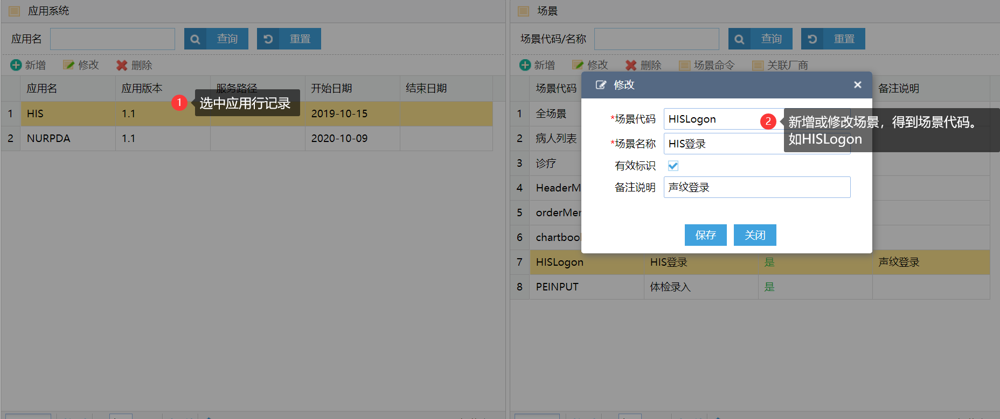

## iMedical语音功能开发说明

#### iMedical内实现语音导航，语音录入类操作的开发实现方式

1. 到【语音HIS配置】界面 > 维护场景

   

2. 在业务界面CSP中写入以下语句，关联界面场景

   ```html
   <EXTHEALTH:HEAD SoundScenes="HISLogon"></EXTHEALTH:HEAD>		
   ```
   ```c#
   // 使用类方法引用声音场景
   /// @param SoundScenes 场景代码
   /// @param Enable      1表示代码层面启用语音，0关闭
   /// @param AppName     系统代码如HIS,NUREPR, 默认HIS
   d ##class(websys.Sound).Init("HISLogon",1)
   ```
   
3. 到【语音HIS配置】界面 > 维护场景命名

   

4. 在业务界面JS中实现以下方法

   ```js
   function soundHISLogon(json){  
       /*     入参为json格式，参数不同语音命令不同
       {cmdKey:"场景名",ExpStr:"参数",BedNo:"床号",PatName:"病人姓名",...}
       */
   	if (json.cmdKey=="logonHisSystem"){
   		// 实现业务，如登录，选中某病人
   	}
   }
   ```
   
5. 如果要语音填充*表单*，请实现以下方法，入参格式如下
   
   ```javascript
   function soundFillForm(json){
       /* {
              cmdDesc:undefined,
              cmdKey:undefined,
              command:{code:2001},
              form:{
                  code:3002,
                  data:[
                      { key:'肝',value:'未触及'},
                      { key:'脾',value:'未触及'}
                  ]
               }
           } */
       // 业务填充表单代码
   }
   ```
   
6. 发送信息

   ```js
   // 使用第2步关联声音场景后，会在界面加载完成后得到soundWS全局websocket对象，可以像下面这样发送消息给声音服务
   function sendSoundMsg(msg){
       if (soundWS.readyState===1){
   		soundWS.send(msg);
   	}else{
   		soundMsgTimer = setTimeout(function(){sendSoundMsg(msg)},300);
   		//连接语音服务中...
   	}
   }
   ```

   

   