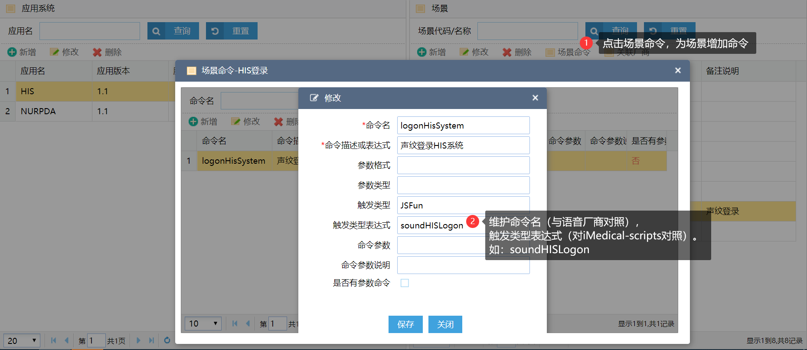

## iMedical语音功能开发说明

#### iMedical内实现语音导航，语音录入类操作的开发实现方式

1. 到【语音HIS配置】界面 > 维护场景

   

2. 在业务界面CSP中写入以下语句，关联界面场景

   ```html
   <EXTHEALTH:HEAD SoundScenes="HISLogon"></EXTHEALTH:HEAD>
   ```

3. 到【语音HIS配置】界面 > 维护场景命名

   

4. 在业务界面JS中实现以下方法

   ```js
   function soundHISLogon(json){  
       /*     入参为json格式，参数不同语音命令不同
       {cmdKey:"场景名",ExpStr:"参数",BedNo:"床号",PatName:"病人姓名",...}
       */
   	if (json.cmdKey=="logonHisSystem"){
   		// 实现业务，如登录，选中某病人
   	}
   }
   ```
5. 如果要语音填充*表单*，请实现以下方法，入参格式如下
   
   ```javascript
   function soundFillForm(json){
       /* {
              cmdDesc:undefined,
              cmdKey:undefined,
              command:{code:2001},
              form:{
                  code:3002,
                  data:[
                      { key:'肝',value:'未触及'},
                      { key:'脾',value:'未触及'}
                  ]
               }
           } */
       // 业务填充表单代码
   }
   ```
   
      